# PhyAssist: Psychological Counseling Software Documentation

## 1. Software Overview

### 1.1 Application Scenarios

The software we designed and implemented is named **PhyAssist**. It is positioned as a tool to assist psychologists, helping them handle patient consultation requests more easily and efficiently through dialogue-based interactions, providing more professional and comprehensive symptom analysis and treatment suggestions.

The primary motivation for our software is to address common challenges that psychologists may encounter in their work:

1. **Consultation History Management**
   In psychological counseling, therapists often need to provide long-term consultation services to multiple patients (*long-term refers to intermittent multiple sessions with the same patient*). In such cases, each patient’s personal information and consultation history must be recorded for reference in future sessions. However, there may be a long gap between two consultations for the same patient, and consultations for different patients may be scheduled closely together.
   Relying entirely on manual management of consultation history can consume a large amount of the therapist’s time and effort in recording, searching, understanding, and organizing patient information, potentially leading to disorganized records or even the loss of important patient data.

2. **Knowledge Retrieval**
   During the process of analyzing symptoms and providing treatment suggestions, psychologists often need to reference existing knowledge. This knowledge comes from a wide range of sources, including past cases, professional knowledge bases, and academic journals. Quickly finding relevant information for a patient’s symptoms and transforming it into actionable advice is a challenging task, traditionally relying heavily on the therapist’s personal expertise.
   As psychological issues become increasingly complex, knowledge updates rapidly, and new cases continuously emerge, effective knowledge retrieval and application have become bottlenecks for providing high-quality treatment. This limits professional development and can affect the quality of counseling received by patients.

Our solution is to leverage the capabilities of large language models (LLMs) in the context of psychological counseling. The model handles the querying and application of the aforementioned types of information (personal data, consultation history, similar cases, relevant research, etc.), condenses it, and presents it to the therapist. Psychologists can interact with the model in real time, achieving **expanded knowledge resources** and **efficient knowledge retrieval**.

Specifically, our software assists psychologists in the following ways:

1. **Convenient and Standardized Information Recording**: Therapists can input information in a very casual manner—even submitting patients’ original statements directly to the software. The system automatically organizes, summarizes, and stores this information in standardized notes, making it easy for psychologists to review at any time and significantly reducing the cost of recording and retrieving information.

2. **Efficient Knowledge Management**: The assistant software is built on a large base of professional psychological knowledge and counseling cases. Therapists can query relevant information through dialogue with the assistant. This expands their knowledge coverage and reduces the effort required to search, organize, and apply knowledge, thereby enhancing professional capabilities.

Our application scenario is illustrated below. Through interaction with the software, psychologists iteratively refine symptom analyses and treatment suggestions, providing more professional counseling services to patients.

<div align="center">
    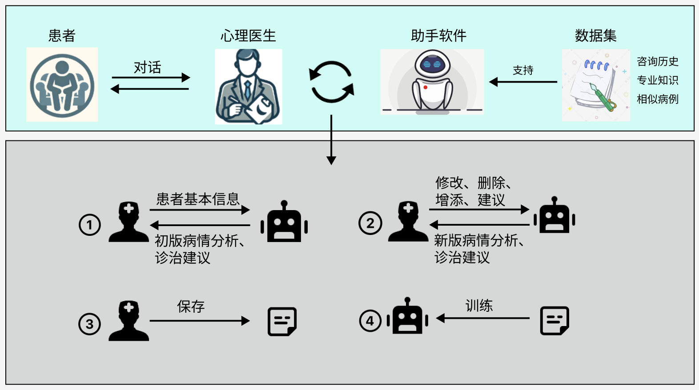  

**Fig. 1**: This figure shows the application scenario of PhyAssist. The main process, depicted in the lower part of the diagram, is the interaction between the psychologist and the assistant model:

1. The psychologist inputs basic information obtained from the patient into the assistant model to receive preliminary analyses and suggestions.
2. The psychologist modifies the model’s analyses and suggestions. This process may iterate multiple times until a satisfactory treatment plan is reached.
3. The final treatment plan is saved in the notes as the patient’s consultation history.
4. Information from the notes is used to update the assistant model, allowing it to better adapt to the psychologist’s habits and remember patient history.

</div>

The fundamental difference between our software and existing psychological counseling software is:

* **Existing counseling models**: Aim to completely replace the psychologist and provide full counseling services directly to patients.
* **PhyAssist**: Positions itself as an **assistant**, providing information to psychologists while remaining hidden from patients, as shown below.

**Why does the “assistant” positioning better meet the needs of the psychological counseling industry?**
Our software is designed for professional counseling, but current large language models cannot fully meet professional counseling requirements, mainly due to the following:

|          Capability Requirement         | Description                                                                                                                                                                                                                                                                                                                                                                            |
| :-------------------------------------: | :------------------------------------------------------------------------------------------------------------------------------------------------------------------------------------------------------------------------------------------------------------------------------------------------------------------------------------------------------------------------------------- |
|   Long interactive dialogue capability  | Counseling requires extended, interactive conversations. One or two sentences are often insufficient, but current models cannot handle such long token inputs.                                                                                                                                                                                                                         |
| Complex interactive dialogue capability | Counseling interactions are more complex than in many other domains. Therapists need to perform emotional analysis of patient statements, provide responses that convey understanding, comfort, and encouragement, offer precise actionable advice, and sometimes ask probing questions to explore deeper issues. Existing counseling models lack these complex interaction abilities. |
|    Sense of companionship and empathy   | Patients require not just a rational information source but an emotionally responsive partner who provides companionship and empathy, allowing patients to express their psychological pressures. This is difficult for current language models to replicate.                                                                                                                          |
|                  Safety                 | Safety includes two aspects: protecting sensitive patient information sent to the model and ensuring that the model’s outputs contain no inappropriate content. As counseling is a clinical service, patients do not fully entrust their mental health to a model.                                                                                                                     |

These limitations make it difficult for a standalone model to be used in professional psychological counseling. As an **assistant**, however, the model’s tasks are greatly simplified—it only needs to provide guideline-level symptom analysis and treatment suggestions for reference, while patient interactions are handled by the therapist. This allows the model’s capabilities to be effectively applied in counseling scenarios.

The next section will provide a detailed introduction to the workflow of our software.

### 1.2 Solution

Our software provides the following solutions to the problems outlined in the previous section:

> 1. **Using a large language model (LLM)** that takes patient information as input and outputs two types of information: **Symptom Analysis** and **Treatment Suggestions**.
> 2. **Recording model outputs as notes** for easy reference and modification by psychologists. The note format is as follows:

<div style="border: 1px solid black; border-radius: 10px; background-color: black; padding: 5pt; margin: 5pt; color: white; width:300pt;height:200pt;overflow:auto;">

### Personal Basic Information

* Demographic data:
* Personal developmental history:
* Mental state:
* Physical condition:
* Social functioning:
  ...

### 1. Note1, Date: xxxx

**Counseling Question**
xxxx

**Analysis**
Symptom Type: xxx
Reasons:

1. xxxx
2. xxxx
   ...

**Advice**

1. xxxx
2. xxxx
   ...

### 2. Note2, Date: xxxx

...

</div>

> 3. **Addressing long-term consultation history**: When providing suggestions, our assistant references notes from consultation history. This feature currently supports relatively short historical texts (about 3,000–5,000 characters). For longer histories or to create a custom assistant tailored to a specific patient group, we offer a **Custom Assistant** service, where users can provide historical notes to fine-tune the assistant model.
> 4. **Expanding knowledge resources**: We fine-tuned the model using large datasets, including **professional knowledge, research findings, and classic cases** in the psychological counseling field, enabling the model to provide analysis and treatment suggestions based on this expert knowledge.
> 5. **Optimizing user experience**: We built a comprehensive **human-computer interaction system**, allowing psychologists to iteratively discuss treatment plans with the assistant.
> 6. **Protecting patient information**: Notes are securely stored using **distributed storage and encryption**, ensuring patient privacy is maintained.

To illustrate, here is an example of a treatment plan generated by the assistant software.

1. **Patient Basic Information:**

|          Information         |                                                                      Value                                                                     |
| :--------------------------: | :--------------------------------------------------------------------------------------------------------------------------------------------: |
|         Demographics         |        Sun, Female, Han ethnicity, 19 years old, Height 1.59m, well-proportioned, normal build, rural background, good family conditions       |
| Personal Development History |     Repeating senior year, failed previous college entrance exam, good family support, few adverse experiences, high parental expectations     |
|         Mental State         | Mild anxiety, insomnia, headache, fatigue, reduced attention, internal distress, introverted personality, not proactive in social interactions |
|      Physical Condition      |                                           No family history of diseases, no major physical illnesses                                           |
|      Social Functioning      |                Repeating senior year, poor math foundation, little progress after tutoring, introverted, not proactive socially                |

2. **Patient Statement**

* **Basic Status:**
  Normal intellectual development, fluent speech, clear consciousness, low mood, inner distress. No hallucinations, no cognitive impairments, full insight, clear help-seeking intentions. Perception normal, memory and thinking normal. Facial expressions show sadness and anxiety, emotional instability, self-control largely intact, coherent and organized speech, consistent behavior. Full insight, actively seeks help. Physical symptoms include insomnia, headache, fatigue, and poor appetite.

* **Statement Summary:**
  I am a repeat student. My parents are very attentive and often visit me at school, bringing treats, hoping I will study hard and get into college to bring honor to the family. But since failing my last exam, my head feels heavy when studying, I cannot focus on my books, yet I cannot bring myself to rest...

3. **Model Generated Results**
   **Analysis:**
   ...
   **Advice:**
   ...

4. **Modifications to Model Results**
   ...

5. **Final Treatment Plan**
   ...

---

### 1.3 Software User Manual

#### 1.3.1 Software Download

**Hardware Requirements**

* GPU: NVIDIA GeForce RTX 3090
* CPU cores: 2
* GPU Memory: 48 GiB

**Software Environment**

* OS: Ubuntu 20.04.4
* Runtime: python==3.8.10, pytorch==2.1.0-cu121

**Download & Installation**
You can download the software package using the following method:

```bash
... To be continued |•'-'•) ✧...
```

After extracting locally, install it as follows:

```bash
... To be continued |•'-'•) ✧...
```

After installation, launch the software using:

```bash
... To be continued |•'-'•) ✧...
```


### 1.3 Software User Manual

#### 1.3.1 Software Download

**Hardware Requirements**

* GPU: NVIDIA GeForce RTX 3090
* CPU cores: 2
* GPU Memory: 48 GiB

**Software Environment**

* OS: Ubuntu 20.04.4
* Runtime: python==3.8.10, pytorch==2.1.0-cu121

**Download & Installation**
You can download the software package using the following method:

```bash
... To be continued |•'-'•) ✧...
```

After extracting locally, install it as follows:

```bash
... To be continued |•'-'•) ✧...
```

Once installed, launch the software using:

```bash
... To be continued |•'-'•) ✧...
```

---

#### 1.3.2 Product Usage Workflow

1. **Creating or Selecting a Note**
   After opening the software, for each new patient, create a new note to record basic information and consultation history. For returning patients, you can directly search for previous notes and click **“start”** to open the note window.

<div align="center">
    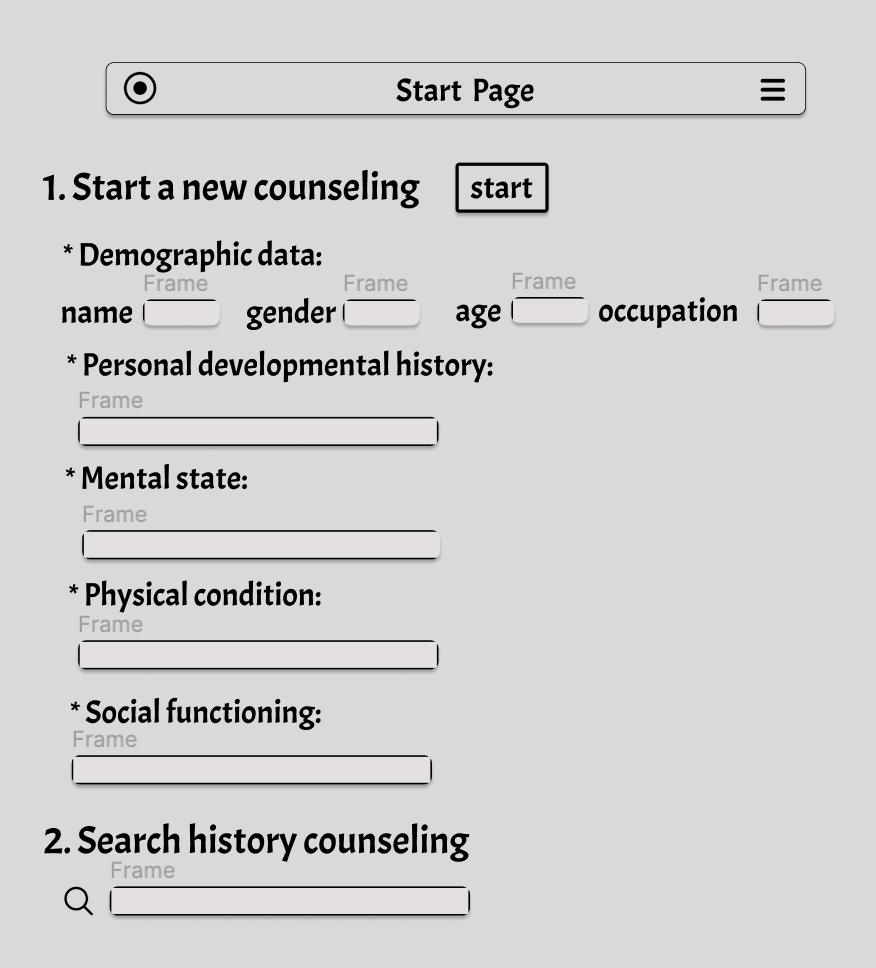
</div>

2. **Selecting the Model**
   When the note window is opened, the software automatically selects a model. If a custom adapter has been fine-tuned for this patient’s history, it will be used by default; otherwise, the base model is employed. Psychologists can review past records and input patient problems into the dialogue box. Clicking **“Analysis”** will generate symptom analyses and treatment suggestions.

<div align="center">
    
</div>

3. **Draft Window**
   After clicking **“Analysis”**, the software opens the draft window where the model’s outputs are displayed as structured bullet points.

<div align="center">
    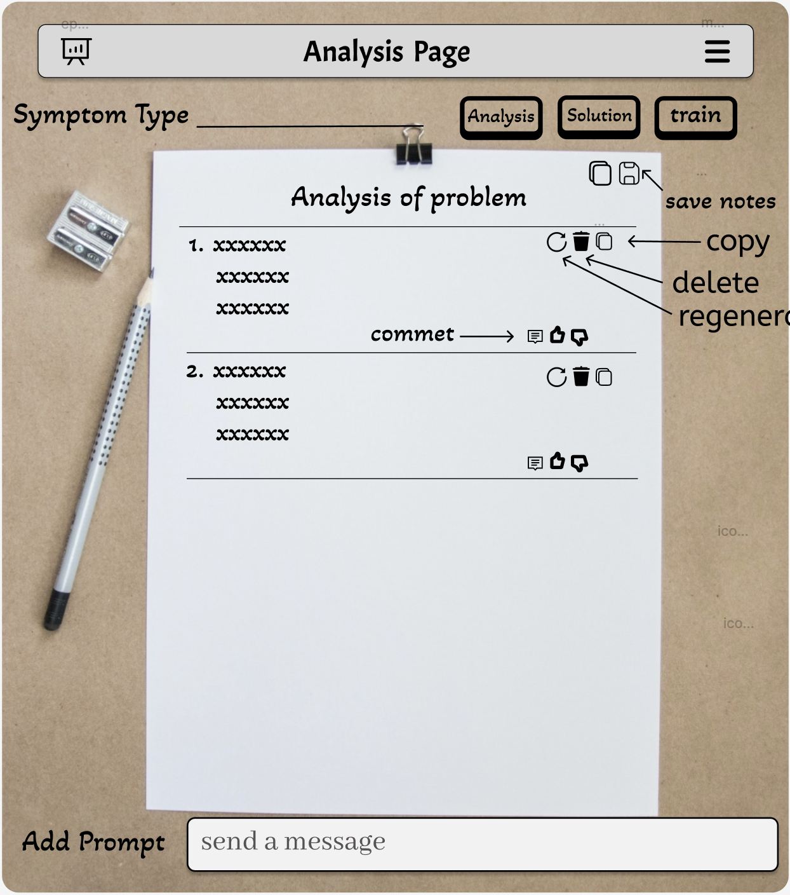
</div>

4. **Editing and Iteration**
   As shown above, users can add, modify, delete, or comment on the model-generated content. After editing specific items, click **“regenerate”** to have the model produce updated content. This allows interactive iteration until the psychologist is satisfied. Finally, click **“save”** to store the draft in the patient’s note.

5. **Training / Fine-tuning**
   Clicking **“train”** uses the newly added note content, including user preferences indicated during edits, to train the adapter. This helps the model better adapt to user habits and remember newly added historical information.

6. **Chat Mode**
   For more flexible usage, a **Chat** mode is provided. Users can bypass the default interaction framework and directly converse with the model to obtain needed information.

<div align="center">
    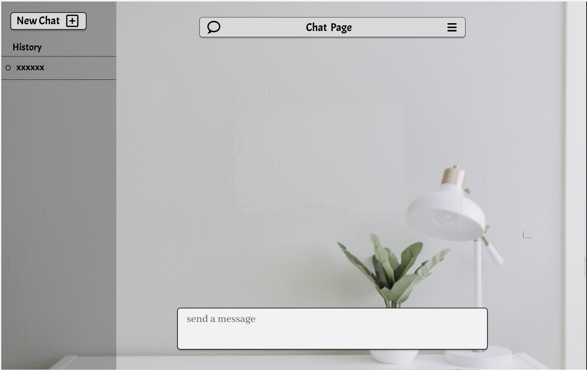
</div>

7. **Usage Summary**
   Steps 1–5 are typically used to generate a global treatment outline. **Chat** mode is designed for quickly retrieving detailed or scattered information, handling issues encountered during real-time patient interactions, and compensating for the rigidity and lower efficiency of the note-based mode.

---

#### 1.3.3 How to Customize Fine-tuning

1. Using the **“train”** button mentioned in step 5, users can fine-tune the model to create an adapter tailored to the current patient. The software provides limited resources for fine-tuning, including restrictions on the number of adapters and the length of notes used.

2. If users need to fine-tune on longer notes or even use all consultation notes as a dataset to create a custom adapter, they can … (〃'▽'〃) To be continued…


## 2. Experimental Design

This chapter introduces the core of our software: the process of fine-tuning a **base pre-trained model** to obtain the **assistant model**, helping readers reproduce our experiments.

<div align="center">
    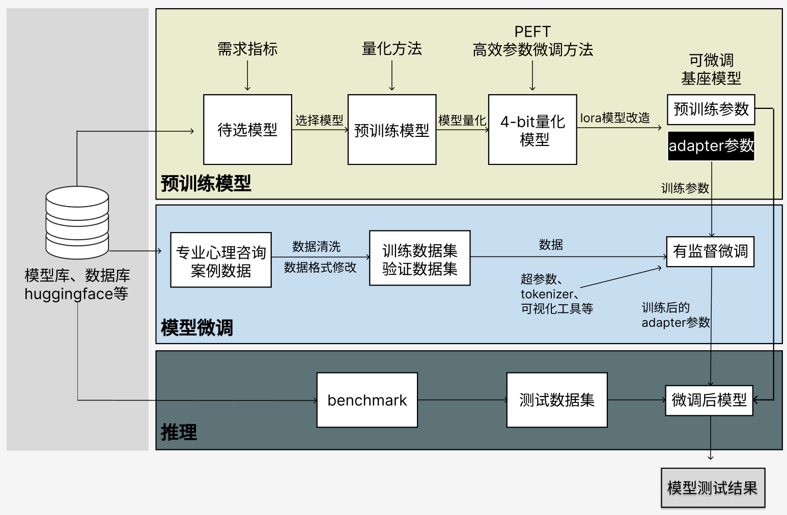

**Fig. 2**: As shown, our experiment consists of three stages:
(1) **Preparation stage**: Setting up the experimental environment, selecting a base model, and loading the base model with quantization.
(2) **Fine-tuning stage**: Selecting and preprocessing the dataset, training the model.
(3) **Evaluation stage**: Evaluating the model, deployment, and related tasks.

</div>

In this experiment, the downstream task for fine-tuning is **Question Answering**, so we chose a **causal language model (decoder-only)**, which excels at this type of task. The basic principle of fine-tuning such a model is as follows:

<div align="center">
    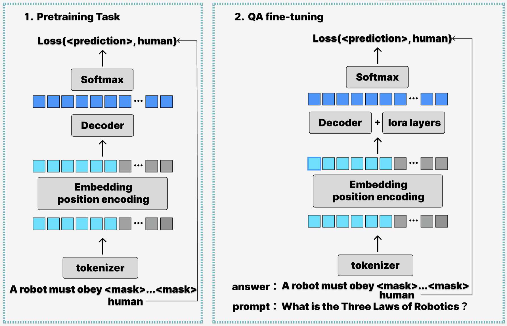

**Fig. 3**: The left diagram shows the pre-training of the base model: next-token prediction. For input text, all tokens following the current token are masked, and the preceding tokens are used as input. The output is a probability distribution over the next token, which is compared with the one-hot encoding of the true token using cross-entropy loss. Parameters are updated via backpropagation.

The right diagram shows the fine-tuning process, which follows the same logic as pre-training. However, during fine-tuning, the **prompt portion** is excluded from the loss calculation; only the **answer portion** is used for loss computation in the same way as pre-training. Additionally, since pre-training used the LoRA method, only the **LoRA layer** parameters are updated during training.

</div>

---

### 2.1 Base Model Selection

Our tasks involve dialogue generation, sentiment analysis, and knowledge retrieval. Therefore, the criteria for selecting a base model are:

1. Limited parameter size due to hardware constraints.
2. Fast inference speed.
3. Suitability for question-answering tasks, as our software’s core functionality is Q&A.
4. Strong text comprehension, to support symptom analysis of patients.
5. Strong common-sense reasoning, to better incorporate expert knowledge for treatment suggestions.

Considering cost and software licensing, we selected base models from the open-source community. Our selection comes from the authoritative **"Open LLM Leaderboard"**, available at: [https://leaderboard.allenai.org/llm/submissions/public](https://leaderboard.allenai.org/llm/submissions/public)

The leaderboard provides multiple evaluation metrics for large language models. We focused on the metrics most relevant to our tasks:

|   Metric  |                                                               Purpose                                                               |
| :-------: | :---------------------------------------------------------------------------------------------------------------------------------: |
|    ARC    |                                           Multiple-choice questions to evaluate QA ability                                          |
|    MMLU   | Multiple-choice tasks across humanities, STEM, mathematics, US history, computer science, law, etc., to evaluate text comprehension |
| HellaSwag |                                       Multiple-choice tasks to evaluate common-sense reasoning                                      |

We examined the top five models on the leaderboard based on average performance across these metrics. The table below summarizes their scores, parameter counts, memory requirements, and inference speeds:

|               Model               | Average |  ARC  | HellaSwag |  MMLU | Params (B) |
| :-------------------------------: | :-----: | :---: | :-------: | :---: | :--------: |
|           Qwen/Qwen-72B           |   76.1  | 65.19 |   85.94   | 77.37 |    72.29   |
|            01ai/Yi-34B            |  75.67  | 65.36 |   85.58   | 76.06 |    34.39   |
|  chargoddard/internlm2-20b-llama  |  71.66  | 64.59 |   83.12   | 67.27 |    19.86   |
| deepseek-ai/deepseek-llm-67b-base |   74.7  | 65.44 |    87.1   | 71.78 |     67     |
|    mistralai/Mixtral-8x7B-v0.1    |  75.34  | 67.41 |   86.63   | 71.98 |    46.7    |

From these results, **Qwen/Qwen-72B**, **01ai/Yi-34B**, and **mistralai/Mixtral-8x7B-v0.1** performed best and are suitable for our application.

We tested memory requirements and found that even with 4-bit quantization, our GPU memory could not support **Qwen/Qwen-72B**, so it was excluded.

Next, we compared **01ai/Yi-34B** and **mistralai/Mixtral-8x7B-v0.1**:

* **01ai/Yi-34B**: smaller parameters, lower memory requirement, supports 200K token context window, good Chinese language support.
* **mistralai/Mixtral-8x7B-v0.1**: uses a sparse mixture-of-experts network, fast inference (comparable to a 12.9B model).

Both models provide mature quantized versions, dialogue models, and fine-tuning guides, making them convenient for use.

We ultimately chose **mistralai’s new Mixtral-8x7B** as our base model. It has 46.7B parameters and uses a **sparse mixture-of-experts network**, which balances parameter size and inference speed while maintaining strong performance.

**Note:** The model actually used in experiments, **Mistral-8x7B-Instruct-v0.1**, is optimized from **Mixtral-8x7B** using supervised fine-tuning and direct preference optimization (DPO), to strictly follow instruction inputs. Its structure is identical; only parameters differ. Compared to **Mixtral-8x7B**, the **Instruct** version performs better on multiple benchmarks.

For more details on Mixtral-8x7B, see the original paper: [https://arxiv.org/pdf/2401.04088.pdf](https://arxiv.org/pdf/2401.04088.pdf)

Besides **Mistral-8x7B-Instruct-v0.1**, we also used **01ai/Yi-34B** as a comparison model, applying the same fine-tuning procedure. Results of the two models are shown in Section 2.4.8.


### 2.2 Dataset and Preprocessing

#### 2.2.1 Dataset Selection

For our application scenario, the required data format is a **(Question – Analysis – Advice) triplet**:

<div style="border: 1px solid black; border-radius: 10px; background-color: white; padding: 5pt; margin: 5pt; color: black; width:300pt;height:200pt;overflow:auto;">

**Counseling Question**

* Basic state of the client:
  Normal intellectual development, fluent and clear speech, clear consciousness, low mood, inner distress. No hallucinations or cognitive impairment, full self-awareness, clear request for help. No perceptual abnormalities, normal memory and thinking, facial expressions show sadness and anxiety, emotional instability, self-control generally intact, speech logical and layered, behavior consistent. Full self-awareness, actively seeks help. Physical condition includes insomnia, headaches, fatigue, poor appetite.

* Summary of client statement:
  I am a repeat student. My parents care about me and often visit school, bringing snacks, hoping I will study hard, pass the university entrance exam, and bring honor to the family. Since failing the last exam, I feel mentally sluggish when studying, cannot focus on books, and hesitate to rest. I get distracted easily in class, worry about failing, and constantly fear performing worse than others during exams. I also worry about having repeated a year compared to classmates in my village; if I fail again, it will embarrass me and my family. I try to study excessively, even under streetlights at night, fearing rest will waste time. For the past three months, my exam performance has been poor and gradually declining, which makes me more anxious. During exams, I feel palpitations, trembling hands, frequent urination, and overall tension, affecting performance. Poor grades cause extreme distress, especially in mathematics, and I cry when thinking about it. As a repeat student, I am embarrassed to ask classmates for help.

**Analysis**
Symptom Type: Academic Anxiety
Analysis:

1. Academic pressure: As a repeat student, high parental expectations, economic and family honor pressures.
2. Emotional distress: Post-failure symptoms such as headache, insomnia, poor appetite indicate significant emotional distress.
3. Self-demand: High self-expectations, fear of underperforming compared to others, strong guilt and distress over exam results.
4. Social pressure: Fear of embarrassment and family reputation, anxious about gaps with peers.
5. Study habits: Studying under sufficient light, even at night, showing overexertion to succeed.

Advice:

1. Psychological assessment: Conduct in-depth evaluation to understand the client’s internal needs and sources of stress.
2. Psychotherapy: Provide cognitive behavioral therapy (CBT) to help the client understand and change negative academic beliefs and emotional responses.
3. Emotion regulation: Teach emotion regulation skills to better manage exam stress and emotional distress.
4. Study strategies: Assist in developing more effective study methods to avoid overwork and fatigue.
5. Family communication: Facilitate family sessions to help the family understand the client’s pressures and develop a reasonable academic plan.
6. Physical health: Guide attention to physical well-being, adjust schedule, and improve sleep quality.

</div>

---

**Raw Data Sources for Dataset Construction**:

| Dataset Name |    Source    | Size (# entries) |                     Description                    |                                                      Download URL                                                      |
| :----------: | :----------: | :--------------: | :------------------------------------------------: | :--------------------------------------------------------------------------------------------------------------------: |
|      DR      |     IMHI     |        600       |     Depression symptom counseling and analysis     |            [https://github.com/SteveKGYang/MentalLLaMA.git](https://github.com/SteveKGYang/MentalLLaMA.git)            |
|   dreaddit   |     IMHI     |        600       |     High-stress symptom counseling and analysis    |                                                      Same as above                                                     |
|      Irf     |     IMHI     |        600       |  Interpersonal risk factor counseling and analysis |                                                      Same as above                                                     |
|    MultiWD   |     IMHI     |        600       | Multi-factor psychological counseling and analysis |                                                      Same as above                                                     |
|      SAD     |     IMHI     |        600       |         Analysis of stress-inducing causes         |                                                      Same as above                                                     |
| counsel_chat | nbertagnolli |       2000       |     Psychological problem counseling and advice    | [https://huggingface.co/datasets/nbertagnolli/counsel-chat](https://huggingface.co/datasets/nbertagnolli/counsel-chat) |

After downloading, the datasets can be converted to the required training format using:
... To be continued |•'-'•) ✧...

Alternatively, preprocessed datasets are available for direct download at:
... To be continued |•'-'•) ✧...

---

#### 2.2.2 Data Preprocessing

Our preprocessing consists of two main steps: **1. Data cleaning**, **2. Data formatting**.

1. **Data cleaning**: Remove empty entries, excessively long texts, URLs, and special characters.
2. **Data formatting**: Convert data to the format required by the base model; otherwise, training may fail or performance may drop. Key steps include adding special tokens to distinguish input from output, ensuring that loss computation ignores input tokens during fine-tuning.

For the Mistral-instruct model, the expected format is:

```
<s> [INST] Instruction [/INST] Model answer </s> [INST] Follow-up instruction [/INST]
```

Where **<s>** and **</s>** mark the start and end of the text, and **[INST]** / **[/INST]** mark the user input.

Example of formatted data:

<div style="border: 1px solid black; border-radius: 10px; background-color: white; padding: 5pt; margin: 5pt; color: black; width:300pt;height:200pt;overflow:auto;">

**<s> [INST]**
**Counseling Question**
xxxx
**[/INST]**
**Analysis**
Symptom Type: xxx
Reasons:

1. xxxx
2. xxxx
   ...

**Advice**

1. xxxx
2. xxxx
   ...
   **</s>**

</div>

---

Data cleaning and formatting can be performed using `gen_csv.py`. For IMHI datasets, set **`<source_data_path>`** to `"train_data/instruction_data/dataset_name.csv"`, and for `counsel_chat` dataset, set it to `"nbertagnolli_dataset/counsel_chat.csv"`:

```bash
gen_csv.py --origin_path <source_data_path> --new_path <output_path>
```

After preprocessing, the dataset is saved in CSV format at the specified **`<output_path>`**.


### 2.3 Software Framework for Model Training

#### 2.3.1 SFTTrainer

The Transformers library provides a well-developed `Trainer` class for handling model training tasks. `SFTTrainer` is a subclass of `Trainer` designed specifically for **supervised fine-tuning** (SFT).

`SFTTrainer` offers many training optimization features, such as gradient accumulation, gradient clipping, learning rate schedulers, linear learning rate warm-up, AdamW optimizer, model checkpoints, and more. All these features can be configured via the Trainer’s parameters.

Using `SFTTrainer` greatly simplifies the training code.

For detailed usage and parameter settings, see the official documentation:
[https://huggingface.co/docs/trl/main/en/sft_trainer](https://huggingface.co/docs/trl/main/en/sft_trainer)

---

#### 2.3.2 PEFT

PEFT (Parameter-Efficient Fine-Tuning) is a library for efficient model fine-tuning, mainly aimed at reducing GPU memory consumption during training.

We use the **LoRA** method (Low-Rank Adapter) provided by PEFT to reduce the number of trainable parameters. The basic idea of LoRA is that during fine-tuning, the original pre-trained model parameters are frozen, and only a low-rank matrix is trained, thereby controlling the number of parameters being updated.

Importantly, after adapting the model with LoRA, the fine-tuned results (the set of low-rank matrices, called **Adapters**) are independent of the original model. Adapters can be added or removed from the model at any time, providing great flexibility. This allows the same base model to host multiple adapters for different downstream tasks.

After applying PEFT, the number of trainable parameters is greatly reduced:

```bash
trainable params: 31465472 || all params: 23514066944 || trainable%: 0.13381552444728806
```

For detailed principles and usage of PEFT:
[https://github.com/huggingface/peft](https://github.com/huggingface/peft)

---

#### 2.3.3 Accelerate

`accelerate` is a library for distributed model training. It allows PyTorch code to run efficiently across any distributed setup. Since our experimental setup uses two GPUs and a single GPU cannot store the entire model, we rely on `accelerate`.

Using `accelerate`, we successfully distributed model parameters across two GPUs. During training, memory usage is evenly split, with both GPUs reaching over 90% utilization.

For more details, see Hugging Face documentation:
[https://huggingface.co/docs/accelerate/index](https://huggingface.co/docs/accelerate/index)

---

#### 2.3.4 BitsAndBytes

`bitsandbytes` is a library for model quantization, supporting 4-bit, 8-bit, and other quantization methods. By reducing parameter precision during storage, it lowers GPU memory requirements.

During our experiments, we used `bitsandbytes` to quantize the model while loading it into memory, allowing normal training after quantization.

With quantization, a 46.7B parameter model was compressed to 27.6 GB of GPU memory. The original pre-trained model size was 96.8 GB; after compression, the model is about 28% of its original size.

For more information on usage:
[https://huggingface.co/docs/transformers/main/en/quantization#bitsandbytes](https://huggingface.co/docs/transformers/main/en/quantization#bitsandbytes)

---

#### 2.3.5 Weights & Biases (wandb)

`wandb` is a free tool for logging experiment data. Compared to TensorBoard, it offers more features, such as recording environment configurations, runtime, loss curves, accuracy changes, learning rate changes, memory usage, and GPU power consumption.

Using `wandb`, we can conveniently log and monitor detailed experiment information.

---

#### 2.3.6 Gradio

`gradio` is a library for building interactive interfaces. It allows us to deploy models on the web so that users can interact with the model through a browser.

After completing model training, we use `gradio` to build a simple web interface to test the model’s performance.

In this project, we implemented a simple demo using `gradio`, which can be run in `demo.ipynb`. Running the demo requires completing the full environment setup and model training.

For Gradio documentation:
[https://www.gradio.app/docs/interface](https://www.gradio.app/docs/interface)


### 2.4 Model Training Process

This section reproduces our training procedure using **Mistral_Fine_Tune.ipynb**.

---

#### 2.4.0 Environment Check

Before training, verify that all dependencies are installed and GPUs are available:

```python
from transformers import AutoModelForCausalLM, AutoTokenizer, BitsAndBytesConfig, TrainingArguments, pipeline, logging, TextStreamer
from peft import LoraConfig, prepare_model_for_kbit_training, get_peft_model
import torch, warnings
from datasets import load_dataset
from trl import SFTTrainer

torch.cuda.is_available()
```

```bash
True
```

---

#### 2.4.1 Load Base Model

Hugging Face’s `AutoModelForCausalLM` helps quickly download and load pre-trained models.

```python
from transformers import BitsAndBytesConfig, AutoModelForCausalLM

base_model = 'mistralai/Mixtral-8x7B-Instruct-v0.1'

# 4-bit quantization configuration using BitsAndBytes
bnb_config = BitsAndBytesConfig(
    load_in_4bit=True,
    bnb_4bit_quant_type="nf4",
    bnb_4bit_compute_dtype=torch.bfloat16,
    bnb_4bit_use_double_quant=False,
)

model = AutoModelForCausalLM.from_pretrained(
    base_model,
    quantization_config=bnb_config,
    device_map="auto",  # automatically distribute model across GPUs
    trust_remote_code=True,
)
```

Check if the model is loaded correctly:

```python
print(model)
```

```bash
MixtralForCausalLM(
  (model): MixtralModel(
    (embed_tokens): Embedding(32000, 4096)
    (layers): ModuleList(
      (0-31): 32 x MixtralDecoderLayer(
        (self_attn): MixtralAttention(
          (q_proj): Linear4bit(in_features=4096, out_features=4096, bias=False)
          (k_proj): Linear4bit(in_features=4096, out_features=1024, bias=False)
          (v_proj): Linear4bit(in_features=4096, out_features=1024, bias=False)
          (o_proj): Linear4bit(in_features=4096, out_features=4096, bias=False)
          (rotary_emb): MixtralRotaryEmbedding()
        )
        ...
```

---

#### 2.4.2 PEFT Model Quantization

We use the PEFT library to convert the model for LoRA fine-tuning, reducing the number of trainable parameters.

```python
from peft import LoraConfig, prepare_model_for_kbit_training, get_peft_model

# Prepare model for LoRA fine-tuning
model = prepare_model_for_kbit_training(model)

# LoRA hyperparameters
lora_alpha = 8
lora_dropout = 0.05
lora_rank = 16

peft_config = LoraConfig(
    lora_alpha=lora_alpha,
    lora_dropout=lora_dropout,
    r=lora_rank,
    bias="none",
    task_type="CAUSAL_LM",
    target_modules=["q_proj", "k_proj", "v_proj", "o_proj", "gate"]
)

model = get_peft_model(model, peft_config)
```

Key parameters:

|    Parameter   |                Description               |            Range           |                             Effect on Training                            |              Recommended             |
| :------------: | :--------------------------------------: | :------------------------: | :-----------------------------------------------------------------------: | :----------------------------------: |
|   lora_alpha   |    Scaling factor for low-rank matrix    |              -             |                Generally set to 2×r for optimal performance               |                   8                  |
|  lora_dropout  |    Dropout probability in LoRA layers    |              -             |                    Regularization for low-rank matrices                   |                 0.05                 |
|        r       |         Rank of low-rank matrices        |       [4,8,16,32,64]       | Lower values often sufficient; higher values do not guarantee improvement |                  16                  |
|    task_type   |                 Task type                |              -             |                Since this is causal LM, set to `CAUSAL_LM`                |               CAUSAL_LM              |
| target_modules | Linear layers for low-rank decomposition | All linear layers in model |                 Covering more layers improves fine-tuning                 | q_proj, k_proj, v_proj, o_proj, gate |

Check the number of trainable parameters:

```python
model.print_trainable_parameters()
```

```bash
trainable params: 31465472 || all params: 23514066944 || trainable%: 0.13381552444728806
```

---

#### 2.4.3 Load Tokenizer

Tokenizers convert text into numerical input vectors for the model and must be passed to `SFTTrainer`.

```python
from transformers import AutoTokenizer

tokenizer = AutoTokenizer.from_pretrained(base_model, trust_remote_code=True)
```

Test the tokenizer:

```python
output = tokenizer.encode("你好呀")
print(output)
print(tokenizer.decode(output))
```

```bash
[1, 28705, 29383, 29530, 232, 148, 131]
<s> 你好呀 </s>
```

### 2.4.4 Load Dataset

We use the Hugging Face `datasets` library to load the preprocessed dataset. `<output_path>` refers to the path where your processed CSV file is stored.

```python
from datasets import load_dataset

data_path = <output_path>
dataset = load_dataset('csv', data_files=data_path, split="train")
dataset
```

Example output:

```bash
Dataset({
    features: ['text'],
    num_rows: 825
})
```

---

### 2.4.5 Configure Training Arguments

Use the `TrainingArguments` class to configure training parameters. These are then passed to the `SFTTrainer`. Below is an example configuration:

<details>
<summary>Click to expand code</summary>

```python
output_dir = "./mistral7b_nbertagnolli"
per_device_train_batch_size = 4       # Reduce batch size if out-of-memory occurs
gradient_accumulation_steps = 4       # Accumulate gradients to simulate larger batch
optim = "paged_adamw_32bit"           # Optimizer for memory-efficient training
save_strategy="steps"                 # Checkpoint saving strategy
save_steps = 20                        # Save checkpoint every 20 update steps
logging_steps = 20                     # Log training metrics every 20 steps
learning_rate = 2e-4
max_grad_norm = 0.3
max_steps = 660                        # Total training steps
warmup_ratio = 0.03
lr_scheduler_type = "constant"         # Learning rate scheduler

training_arguments = TrainingArguments(
    output_dir=output_dir,
    per_device_train_batch_size=per_device_train_batch_size,
    gradient_accumulation_steps=gradient_accumulation_steps,
    optim=optim,
    save_steps=save_steps,
    logging_steps=logging_steps,
    learning_rate=learning_rate,
    fp16=True,
    max_grad_norm=max_grad_norm,
    max_steps=max_steps,
    warmup_ratio=warmup_ratio,
    group_by_length=True,
    lr_scheduler_type=lr_scheduler_type,
)
```

</details>

**Key parameters:**

|          Parameter          |             Description             |                               Effect                              |          Recommended          |
| :-------------------------: | :---------------------------------: | :---------------------------------------------------------------: | :---------------------------: |
|            optim            |    Optimizer for stable training    |            Smooths training, reduces loss oscillations            |      "paged_adamw_32bit"      |
| per_device_train_batch_size |          Batch size per GPU         | Larger values increase memory usage; smaller values slow training |               4               |
| gradient_accumulation_steps |    Steps to accumulate gradients    |    Allows effective larger batch size without increasing memory   |               4               |
|        learning_rate        |       Optimizer learning rate       |        Large: unstable training; small: slower convergence        |              2e-4             |
|        max_grad_norm        |     Gradient clipping threshold     |                    Prevents gradient explosion                    |              0.3              |
|          max_steps          |         Total training steps        |       More steps: longer training; fewer: potential underfit      | Set according to dataset size |
|         warmup_ratio        | Fraction of steps for linear warmup |                    Reduces initial overfitting                    |              0.03             |

---

### 2.4.6 Enable wandb Logging

WandB automatically logs training metrics, GPU usage, and other experimental details.

```python
import wandb
wandb.login()
# True
```

---

### 2.4.7 Start Training

Use the `SFTTrainer` class to launch training:

```python
trainer = SFTTrainer(
    model=model,
    train_dataset=dataset,
    peft_config=peft_config,
    dataset_text_field="",
    tokenizer=tokenizer,
    args=training_arguments,
    packing=True,
)

trainer.train(resume_from_checkpoint=True)
```

Once training starts, WandB will capture logs and metrics. You should see progress bars and loss decreasing:

<div align="center">
    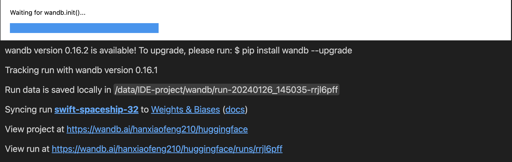
</div>

<div align="center">
    
</div>

After training reaches the specified `max_steps`, the process stops automatically, saving the trained adapter parameters and configuration files under `output_dir` in folders named like `checkpoint-step_num`.

---

### 2.4.8 Training Results

The table below shows **Mistral-8x7B-Instruct-v0.1** and **01ai/Yi-34B** results on the **IMHI-DR** dataset:

|              Model             |                           F1                           |                           Train Loss                           |                            Val Loss                           |
| :----------------------------: | :----------------------------------------------------: | :------------------------------------------------------------: | :-----------------------------------------------------------: |
| **Mistral-8x7B-Instruct-v0.1** | 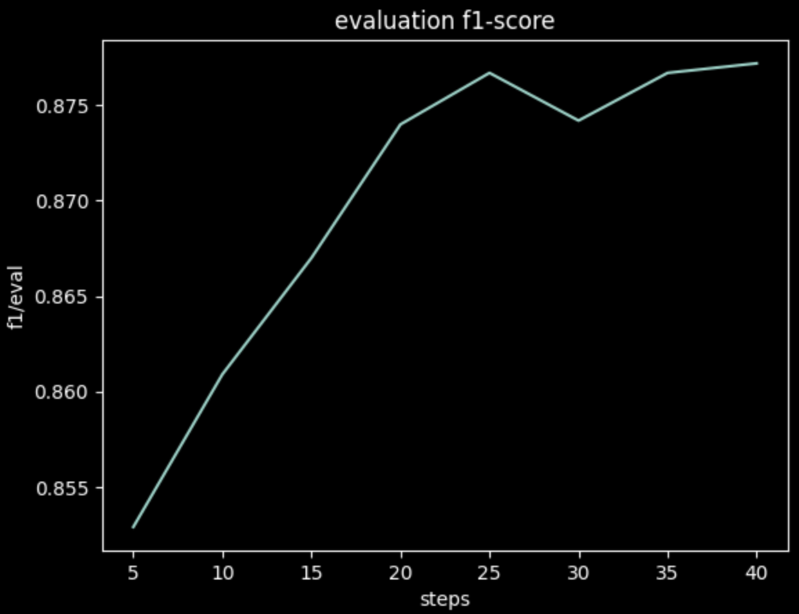 | 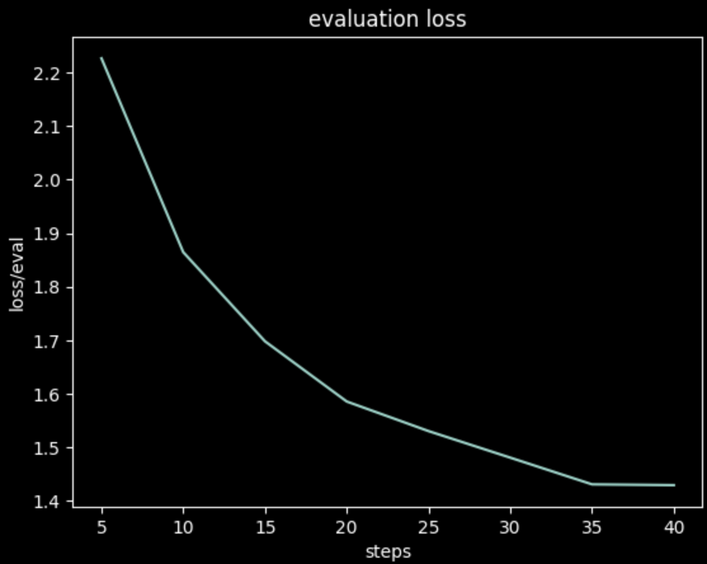 | 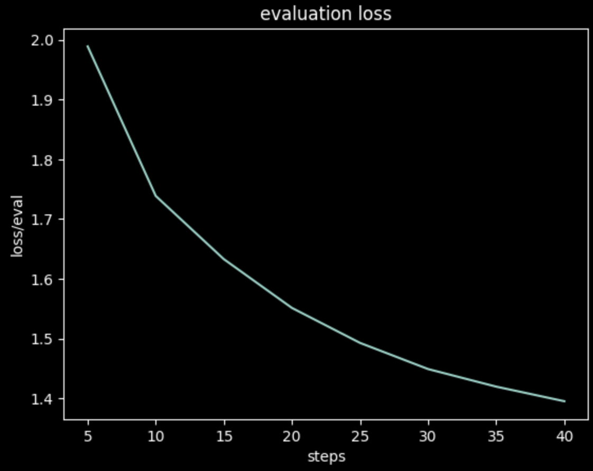 |
|         **01ai/Yi-34B**        |  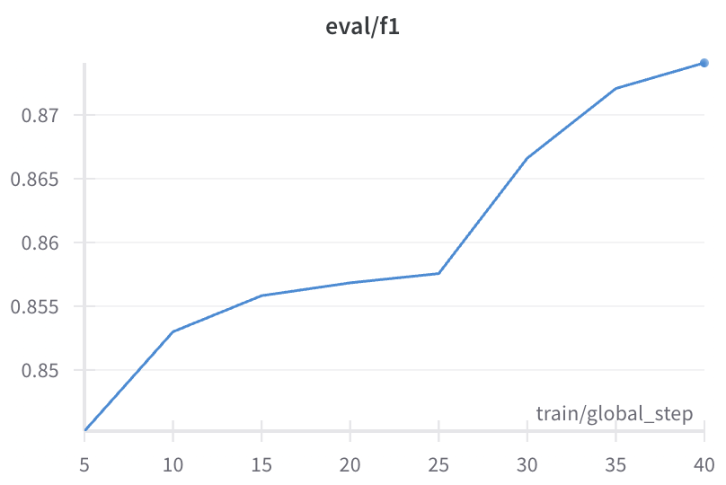 |  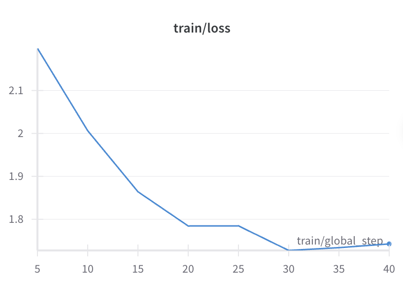 |  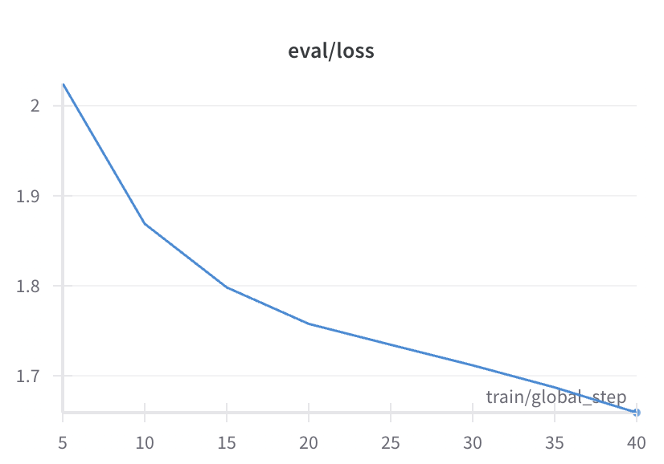 |

**Training setup:**

* GPUs: 2
* Optimizer: `paged_adamw_32bit`
* Learning rate: 2e-4
* Batch size: 8
* Epochs: 8
* Warmup ratio: 0.03

These results demonstrate effective convergence of both models on the dataset and the utility of LoRA adapters for efficient fine-tuning.

### 2.5 Model Testing
In this experiment, we used the testing platform provided by the IMHI project. The test focused on one of the core capabilities of the model: generating a condition analysis based on the patient’s statement (the analysis includes identifying the type of psychological disorder and providing the reasoning behind this judgment).

The testing is divided into two parts: the accuracy and quality of the model output, corresponding to two metrics: F1 and BartScore. The former measures the overlap between the model-generated text and the gold standard, indicating whether the model correctly predicts the type of psychological problem and provides a reasonable analysis. The latter evaluates the quality of the generated text, i.e., fluency, grammatical correctness, etc.

<div align = "center">

Model    |  Param. |   DR | Dreaddit | IRF |  MuliWD | 
|:---:|:---:|:---:|:---:|:---:|:---:|
|SADLLaMA-7B  |7B   | 58.91  | 3.51  |  38.02   |  40.1| 11.04 |
|LLaMA-13B  | 13B  |  54.07  | 36.28  | 38.89  | 53.65  |  13.2 |
|ChatGPT  |    175B  | **82.41**  | 71.79  | 41.33 |  62.72 | 54.05|
|GPT-4  | 175B  | 82.0  | **78.18** | 51.75  | 62.58  |  55.68|
|Gemini Pro | Unknown | 74.81  | 45.17 | 57.23  | **73.33**  |  61.92|
|PsyAssist   |   46.7B  |  76.88   | 77.37  |  **61.23**  |  66.61   | 55.58|

*The test results and comparison data are shown in the figure. DR, Dreaddit, IRF, MultiWD, and SAD represent five test datasets. The vertical axis lists the models being compared, and the scores correspond to the F1 values on each dataset. It can be seen that our model achieves evaluation metrics that are comparable to or exceed other models on each dataset, with the best performance on the IRF dataset.*
</div>

The testing code is provided in `mistralai_test.ipynb`, including methods for loading the model, performing inference, and using the MentalLLama testing platform. Detailed instructions on using the testing platform can be found in the MentalLLama project documentation: https://github.com/SteveKGYang/MentalLLaMA.git

Testing the model's performance when deployed in software is planned for future work.

### 2.6 Model Release
After completing the model testing, the model can be released on Hugging Face. Hugging Face provides a platform for model release, making it easier for others to use the model.

To release a model, first log in to your Hugging Face account:
```python
from huggingface_hub import notebook_login
notebook_login()
````

Next, load the model to be released using the method described in section 4.1. After loading, the model can be pushed directly to Hugging Face using the `push_to_hub` function. For example, the following code pushes the `idegroup/PhyAssist` model to Hugging Face:

```python
# The first argument is the model name, the second is your organization name
model.push_to_hub("PhyAssist", organization="idegroup")
```

It is important to note that since our trained model exists in the form of an adapter, only the adapter parameters need to be uploaded when releasing the model. There is no need to upload the base model parameters; only the configuration of the base model used is required. When using our model, Hugging Face will automatically download the base model based on the configuration and load the adapter into it. This simplifies model release and usage because the adapter is much smaller than the full model, allowing for fast upload and download.

Once the model is uploaded, it can be accessed from Hugging Face using the following:

```python
from transformers import AutoModelForCausalLM
model = AutoModelForCausalLM.from_pretrained("idegroup/PhyAssist")
```

### 2.7 Developing the Application System

We have already pushed the model to Hugging Face. The model URL is [https://huggingface.co/idegroup/PhyAssist](https://huggingface.co/idegroup/PhyAssist), and it can be loaded using the Hugging Face API for inference.

A basic application system can be built using the `gradio` library, which allows the creation of a simple yet fully functional web interface for testing and showcasing the model. Our project provides a demo program `demo.ipynb` that users can follow to build their own application systems.

### 2.8 Application Deployment

For deployment, a simple approach is to use Gradio’s functionality to host the application on Hugging Face’s Spaces platform. This generates a publicly accessible Gradio web app. Each project space is free with 8 CPU cores and 16GB of RAM, while GPU resources require separate payment.

Detailed deployment instructions are available in the official documentation:
[https://huggingface.co/docs/hub/spaces-sdks-gradio](https://huggingface.co/docs/hub/spaces-sdks-gradio)

### 2.9 Common Issues and Troubleshooting

#### 2.9.1. Issues accessing Hugging Face for model or data downloads

You can use the mirror site [https://hf-mirror.com](https://hf-mirror.com). The following command sets all download URLs in the Transformers library to the mirror site:

```bash
HF_ENDPOINT=https://hf-mirror.com 
```

#### 2.9.2. How to know the required training data format for a model

Generally, the training data format is described in the documentation of the Hugging Face model project. If not found, you can check the `tokenizer_config.json` file in the project folder to view the tokenizer configuration. The **chat_template** field usually indicates the input format for the tokenizer, which corresponds to the required training data format:

```json
"chat_template": "{{ bos_token }}{% if (message['role'] == 'user') != (loop.index0 % 2 == 0) %}{{ raise_exception('Conversation roles must alternate user/assistant/user/assistant/...') }}{{ '[INST] ' + message['content'] + ' [/INST]' }}{{ message['content'] + eos_token}}{{ raise_exception('Only user and assistant roles are supported!') }}"
```

#### 2.9.3. How to specify target_modules in LoraConfig when building PEFT

The model parameter matrices that require low-rank decomposition should be set to key layers in the original model. You can view the layer names using Python:

```python
print(base_model.named_parameters)
```

As shown in the figure, the parameters suitable for low-rank decomposition include `q_proj`, `k_proj`, `v_proj`, `o_proj`, `gate`, etc.
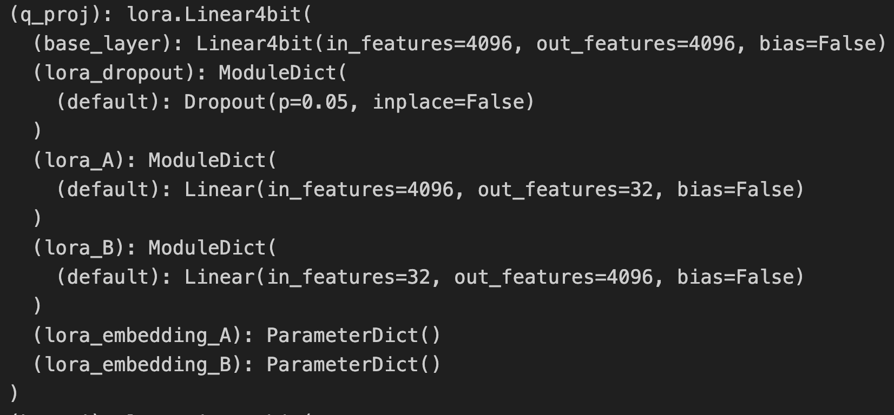

#### 2.9.4. Gradients not decreasing during training

During training, I encountered an issue where the training gradients were not decreasing.

For large model fine-tuning, given limited time, a trade-off between dataset size and number of epochs is often needed. Initially, I trained with a very large dataset, but it took a long time to complete a single epoch. With few epochs, the model's adaptation to downstream tasks did not improve significantly, and the loss remained around 1.5. I then reduced the dataset size and trained for more epochs, which resulted in a significant decrease in loss.

Therefore, it may be more effective to train the model for more epochs rather than merely increasing dataset size. This is likely because fine-tuning aims to teach the model the response patterns for downstream tasks. Training multiple times on a few typical response patterns is more beneficial than training fewer times on many patterns. Since the large model has already undergone extensive pretraining, overfitting is less of a concern.

These are empirical observations without solid theoretical backing, and further study is required. For this experiment, additional training data would further improve performance, which is a point for future work.

#### 2.9.5. Running out of GPU memory during training

Due to the large parameter size, GPU memory issues may arise during training. The following strategies can reduce memory usage:

1. **Reduce batch_size**: Slows down training, requiring a trade-off between batch_size and speed.
   Method: set `per_device_train_batch_size` in `TrainingArguments`.
2. **Gradient Checkpointing**: Saves only intermediate results at checkpoints during forward propagation; other intermediates are recomputed during backward propagation. Reduces memory usage but slows training.
   Method: set `gradient_checkpointing=True` in `TrainingArguments`.
3. **Gradient Accumulation**: Accumulates gradients over multiple forward passes before backpropagation, reducing memory but slowing training.
   Method: set `gradient_accumulation_steps` in `TrainingArguments`.
4. **Model Quantization**: Converts model parameters to lower precision, greatly reducing memory usage but may slightly reduce accuracy.
   Method: use the **bitsandbytes** library, see section **2.1.3 Base Model Download**.
5. **LoRA**: Applies low-rank decomposition to reduce memory usage.
   Method: use the **PEFT** library, see section **2.3.2 PEFT**.

#### 2.9.6. Merging multiple trained adapters

During experiments, multiple adapters were trained. LoRA allows each adapter to be applied to the base model independently. However, combining multiple adapters may cause interference, and no optimal method exists for merging multiple adapters.
The simplest approach is to combine all relevant datasets during training and train a single comprehensive adapter, which is the method we adopted.

## 3. Project Summary

In this project, we addressed two common issues faced by psychologists: **efficient patient data management** and **knowledge expansion**. Our solution: **fine-tune a large model to create a psychologist assistant**.

We fine-tuned a 47B parameter base model on two 27GB GPUs and evaluated it on the IMHI benchmark. The results show that our model outperforms current state-of-the-art psychological models across multiple metrics, demonstrating effectiveness on downstream tasks.

We also built a full application based on our model, implementing the features described at the beginning of this document. User trials indicate the application can assist psychologists with data organization and consultation discussions, though professional content quality requires further improvement.

We created a dataset from professional psychology cases in the format **"Question-Analysis-Suggestion"**, serving as a foundation for future work or related research.

This document shares experiences in fine-tuning large models for downstream tasks, including dataset construction, model selection, training, and deployment. It can guide researchers conducting similar work.

This document can also serve as a reference for large model projects on other tasks. Sections 2.3 and 2.4 can be adapted with minimal code changes, and other sections can be customized while keeping the title framework.

## 4. Existing Issues and Future Improvements

### 4.1 Clarity and accuracy of textual and graphical expressions

```bash
... To be continued |•'-'•) ✧...
```

### 4.2 Topics for further research

```bash
... To be continued |•'-'•) ✧...
```

### 4.3 How to improve software capability and usability
```bash
... To be continued |•'-'•) ✧...
```
