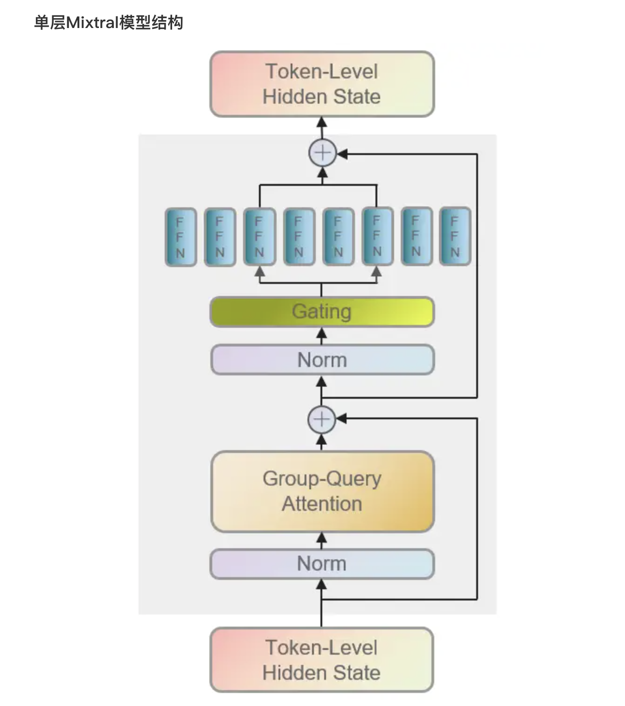

# Experimental Replication Document Outline of Counseling Advice Generator Software
## 1. 软件简介
### 1.1 应用场景
我们设计和实现的软件命名为 PhyAssist，其应用领域定位在心理咨询行业，针对心理医生目标人群，提供的服务是作为心理咨询医生的助手，使用对话方式提供指定患者的诊治建议。  

用户可以将患者的症状或者病情描述输入到系统中，系统会根据输入的内容，生成对应的症状分析和诊治建议，生成的信息会以笔记的形式分条陈述，方便医生进行参考。  

我们的软件致力于将大语言模型的能力引入到心理咨询行业，赋予心理咨询医生如下两项能力： 
1. 广泛的知识储备：我们会致力于在微调工作中激发出语言模型在预训练所使用大量语料中的知识，并体现在诊治建议中。这项能力能够弥补心理咨询师在面对目前复杂化多样化的心理问题时的知识空缺。     
2. 咨询历史记录能力： 我们的软件会将用户咨询-模型解答对话作为历史记录下来，通过针对不同的患者开启不同的对话，模型可以根据历史信息为指定患者的心理问题提供更加个性化的、长期化的解决方案。这项能力能够在患者人数多、咨询周期长的情况下，帮助心理咨询师更好地管理患者的心理问题。

相关的心理咨询模型和软件产品的主要问题是难以应用在实际的心理咨询场景中，因为目前大模型的文本生成能力无法应对心理咨询领域的要求，比如：
* 超长的交互式对话能力：心理咨询往往需要进行长时间的交互式交流，一两句话往往起不到该有的效果，但语言模型往往无法接受如此长的token输入）。
* 复杂的交互式对话能力：心理咨询场景下的交流往往相对于其他领域更加复杂。心理咨询师需要对患者的话语进行情感分析；给出的回复中需要包含理解、安慰、鼓励等多种情感元素；给出的回复不能仅仅是大话空话，要给出一针见血的建议帮助患者解决困境；心理咨询师需要反向提问，以便对患者的问题进行更深层次的挖掘等等。这种复杂的交互式对话能力是目前已有的心理咨询模型欠缺的。
* 陪伴感和认同感：在心理咨询场景中，患者相对于一个理性的信息源，更加需要对方是一个有感情的人，能够给予患者陪伴感和认同感，能够将让患者对心中的压力进行倾诉，这是机器永远也无法做到的。

总之，当前心理咨询行业的软件产品和模型产品无法满足心理咨询需求的根本原因是，想要将软件与心理咨询师完全分隔开来，让软件能够完全替代心理咨询师，但由于上述的分析，这是很难做到的。

同时这也是我们的产品所针对解决的问题：即如何让大模型的能力能够有效地、正确地应用到心理咨询之中。

### 1.2 生成诊治建议解决方案
我们的解决方案是将大模型的能力与心理咨询师的能力结合起来。模型的功能并不是直接面向患者提供咨询服务，而是作为助手角色面向心理咨询师提供分析建议，由心理咨询师负责对模型输出进行实时的筛选和修改，面向患者进行诊治。

我们的软件在心理咨询场景中的角色可以看作一个参谋，它获取信息的渠道有两条：**患者的问题描述** 以及 **心理咨询师的修改**，二者是通过笔记的形式来进行组织。整个心理咨询的逻辑流程如下图所示：

1. 心理咨询师通过对话的方式从患者处获得问题描述。  
2. 将新获得的患者的问题描述、或者修改后的上一次的模型输出记录在笔记中。
3. 模型读取笔记中的内容。
4. 模型生成对应的症状分析和诊治建议，生成的信息会以分条的形式进行呈现。
5. 心理咨询师对建议进行筛选和修改或者添加内容。
6. 当心理咨询师认为已经从模型处获得足够的信息，将笔记进行整理获得最终的诊治建议。
7. 心理咨询师将诊治建议以对话的形式传达给患者。

可以看出，为了将大模型的能力在心理咨询场景最大可能地应用，我们设计了一个心理咨询师与模型的交流环路以便二者的充分互动。其中交流的渠道就是存储下来的笔记，笔记基本上以（问题-解答）二元组的形式进行存储，心理咨询师负责提供问题以及修改解答，模型负责生成解答。心理咨询师可以通过 **修改答案，输入模型，得到新的答案** 的迭代过程逐渐获得满足客户需求的诊断笔记。

需要注意的是，我们的模型的工作是最基本的建议以及思路，将其进行具体化和加入情感元素等工作需要心理咨询师自己完成，或者在迭代的过程中逐渐进行修改。

### 1.3 系统使用手册
本项目中并未提供完整的软件实现，此工作需要在后续的工作中进行完善。我们实现了一个微调后的助手模型并提交到了 **huggingface** 中，模型地址为：**"idegroup/PhyAssist"**。

在demo.ipynb中提供了一个简单的 **demo**，提供了最基本的输入问题，输出分析和建议的功能，输出会以笔记的形式进行呈现。在使用前需要安装可能要用到的库，安装完成后进入demo.ipynb，进行正常的代码运行即可。
```bash
pip install -r requirements.txt
```
我们并未提供在线的模型体验网站，因此只能在本地体验模型效果，运行我们的demo.ipynb，需要至少需要35GB显存用于加载基础模型。

如果要下载我们的模型构建自己的应用，可以参考demo.ipynb中的代码从hugging face中加载并使用我们的模型。

## 2. 重现实验步骤和方法
### 2.0 实验环境
我们的训练是在配备有两个 NVIDIA GeForce RTX 3090（总计48 GiB）的Linux系统上进行的，训练代码和模型使用PyTorch实现，利用了Accelerate、PEFT、BitsAndBytes和transformers等软件包，基座模型采用Mixtral-8x7B-Instruct-v0.1。

可以使用如下命令下载所需要的软件库。
```bash
pip install -r requirements.txt
```

### 2.1 基础模型选择
实验的第一步是根据我们的应用场景选择合适的基础模型，我们从github以及huggingface寻找并尝试了一系列模型，如GPT系列（gpt-2、gpt-neo-2.7B）、LLama系列（LLama-2-7B）、falcon-7b、mistralai系列等模型，我们选择主要考虑的问题是如何将模型的资源需求与模型的性能做出折中选择，尽量寻找一个性能足够好，同时可以满足其资源需求的模型。其中性能主要指的是模型生成结果的质量，资源需求包括模型**存储的显存需求**和模型的**推理速度**两方面

一般预训练语言模型资源可以到github或者huggingface中去寻找：huggingface中对于模型的分类更加清晰，查找更加方便，同时对于预训练模型的下载提供了一个自动化的方法，便于模型的使用。github中一般模型的简介会更加详细，如果要进一步了解模型的细节，可以参考github中的介绍。 

我们最终选择了 **mistralai** 新推出的 **Mixtral-8x7B** 作为我们的基座模型。模型的参数量为46.7B，结构是mistralai系列提出的**稀疏的专家混合网络**，在控制参数量规模并且提升模型推理速度的同时，性能也相对较优。
注：实验中实际使用的模型 **Mistral-8x7B-Instruct-v0.1** 是在 **Mixtral 8x7B** 的基础上通过监督微调和直接偏好优化(DPO)进行优化后的版本，以让之能够更加严格地遵循指令输入格式，模型结构完全相同，只是参数不同。相对于 **Mixtral 8x7B**，**Mixtral 8x7B Instruct** 在多个测试集上的表现有所提升。

#### 2.1.1 简要介绍一下Mixtral 8x7B的模型结构特点: 
如下图所示，Mixtral采用被称为 **稀疏的专家混合网络** 的结构，基于解码器结构，这个结构的特点是将transformers的前递层（FFN）分为若干个专家，每个专家是一个小型的MLP，对于每个输入的token来说，只使用其中的两个专家对token进行计算，然后将计算结果进行加权求和，得到最终的输出。  
有一个路由层（Gating/Router）负责预测给定token具体由哪两个专家进行计算，它本质上也是一个可供训练的线性层。

注：Mixtral 8x7B 论文地址：
https://arxiv.org/pdf/2401.04088.pdf 

#### 2.1.2 此模型的优势：
* 性能：在多个测试集上匹配或优于 Llama_270B 以及 GPT3.5。下图取自Mistral AI的论文，展示了Mixtral 8x7B在多个测试集上的表现。

* 推理速度：这个结构的好处是在保证模型在前递全连接层的参数量不变（即网络的表达能力不变）的情况下，每次计算只使用其中的一部分参数（两个专家模块），从而大大减少了在前递过程中的计算量，提升了模型的推理速度。Mixtra-8x7B的推理速度和成本与 12.9B 的模型大致相同。 
* 存储空间：Mixtral 8x7B的存储空间为46.7B，相对于同性能下的GPT3.5的175B，Llama_270B，所需要的存储空间大大减少。在进行4-bit模型量化操作后，模型加载所需的显存空间进一步压缩到27.6GB，使用lora进行微调时显存需求达到我们使用的显卡资源恰好可以满足这个需求。
* 新颖性：这个模型是在23年底最新发布的模型，针对此模型的下游应用任务的研究还很少，我们的工作可以作为一个新的尝试，方便与其他模型进行对比。

#### 2.1.3 基座模型的下载
AutoModel 是 huggingface 提供的一个类帮助我们自动快速下载模型，我们可以使用如下代码下载模型。
```python
from transformers import BitsAndBytesConfig, AutoModelForCausalLM, prepare_model_for_kbit_training

base_model = 'mistralai/Mixtral-8x7B-Instruct-v0.1'

bnb_config = BitsAndBytesConfig(
    load_in_4bit= True,
    bnb_4bit_quant_type= "nf4",
    bnb_4bit_compute_dtype= torch.bfloat16,
    bnb_4bit_use_double_quant= False,
)
model = AutoModelForCausalLM.from_pretrained(
        base_model,
        quantization_config=bnb_config,
        device_map="auto",
        trust_remote_code=True,
)
model = prepare_model_for_kbit_training(model)
```
其中，我们使用了 **BitsAndBytes** 这个库对模型进行了4-bit量化，这个库的使用方法可以参考： 
https://huggingface.co/docs/peft/v0.7.1/en/developer_guides/quantization#quantization

### 2.2 数据集和预处理
#### 2.2.1 数据集选择：
根据我们的应用场景，我们需要的数据格式为 **（问题-分析-建议）** 的三元组，问题由用户提供，由模型生成对问题的分析和解决问题的建议。因此我们针对性地选择了两个数据集对模型进行微调，分别是 **IMHI数据集** 和 **nbertagnolli数据集**。二者可以通过如下方式进行下载：  
**IMHI数据集**
```bash
git clone https://github.com/SteveKGYang/MentalLLaMA.git
```
**nbertagnolli数据集**
```bash
huggingface-cli download nbertagnolli/counsel-chat --repo-type dataset --include 20220401_counsel_chat.csv --local-dir nbertagnolli_dataset
```

其中 **IMHI数据集** 中的数据的类型是 **“问题+分析”**，其中包含了不同种类心理问题的问题描述，以及对于此类问题的种类判断与原因分析，使用此数据集进行微调可以让模型学习到对于心理问题描述的分析能力。  
同时**IMHI数据集**中也提供了一个较为完善的评测系统，可以作为我们模型的benchmark，可以很方便地将我们的微调模型的性能与其他模型进行对比，具体的IMHI测试系统使用方式详见IMHI项目中的Readme文件。

**nbertagnolli数据集** 中的数据类型是 **“问题+建议”**，其中包含了不同种类心理问题的问题描述，以及对于此类问题的建议，使用此数据集进行微调可以让模型学习到对于心理问题描述的建议能力。

鉴于训练所有数据集耗时耗能太大，我们将所有使用到的数据集中随机挑选了600条用于最终的训练，所有训练用到的的数据集组成如下：
| 数据集名称 | 数据集来源 | 数据集大小（条）|
| :----: | :----: | :----: |
| DR | IMHI | 600 |
| dreaddit | IMHI | 600 |
| Irf | IMHI | 600 |
| MultiWD| IMHI | 600 |
| SAD | IMHI | 600 |
|counsel_chat| nbertagnolli | 600 |

#### 2.2.2 数据预处理
我们对于数据的预处理工作主要分为两部分：1. 对数据的清洗；2. 对数据的格式转换。
1. 对数据的清洗：将空数据、过长的数据、含有网址的数据、含有特殊字符的数据等去除。
2. 对数据的格式转换：将数据转换成基座模型要求的格式，否则会导致模型无法正常训练或者效果的显著降低。    
    Mistral_instruct 模型的文档中给出的格式为：
    ```
    <s> [INST] Instruction [/INST] Model answer</s> [INST] Follow-up instruction [/INST]
    ```
    其中 **<s>**、**</s>**标记文本的开始和结束，**[INST]** 和 **[/INST]** 用于标记用户的输入，其余部分为模型的输出，主要的区别是标记的内容会被模型忽略，不会被用于模型的训练，而是用于指导模型生成的内容。  
    我们只需将数据构造为如下格式即可，后面训练过程中调用SFTTrainer中的函数可以自动完成到基座模型要求的格式的转换。
    ```json
    {"prompt": "<prompt text>", "completion": "<ideal generated text>"}
    {"prompt": "<prompt text>", "completion": "<ideal generated text>"}
    {"prompt": "<prompt text>", "completion": "<ideal generated text>"}
    ```
对于数据的清洗和格式转换可以通过gen_csv.py完成，其中需要指定输入数据的路径和输出数据的路径，对于IMHI数据集，需要使用其中的 **“train_data/instruction_data”** 中的训练数据，否则可能需要对gen_csv.py进行修改。
```bash
    gen_csv.py --origin_path <source_data_path> --new_path <output_path>
```
在完成数据处理工作之后，就可以使用datasets库进行数据的加载并构建数据集，data_path 为数据集文件的路径。
```python
dataset = load_dataset("csv", data_files={"train": data_path})
```

#### 2.2.3 Tokenizer
Tokenizer分词算法是NLP大模型最基础的组件，基于Tokenizer可以将文本转换成独立的token列表，进而转换成输入的向量成为计算机可以理解的输入形式。

huggingface中的模型项目中都会提供一个 tokenizer.config 文件，Transformers库中AutoTokenizer类会根据这个文件中的配置来构建出对应的分词器，其实如果将分词器看作一个特殊的模型的话，加载分词器的过程就和加载模型的过程一样了。 
```python
from transformers import AutoTokenizer
tokenizer = AutoTokenizer.from_pretrained(base_model, trust_remote_code=True)
```

Tokenizer一般不需要什么手动的特殊配置，模型的作者会提供一个默认的分词器，这个分词器在大部分情况下都能满足需求。将初始化得到的tokenizer传递到SFTTrainer中，SFTTrainer就会自动使用它来处理输入的数据，使用十分方便。

接下来给出一个tokenizer的使用示例
```python
from transformers import AutoTokenizer
tokenizer = AutoTokenizer.from_pretrained("mistralai/Mixtral-8x7B-Instruct-v0.1")
output = tokenizer.encode("你好呀")
print(output)
print(tokenizer.decode(output))
# [1, 28705, 29383, 29530, 232, 148, 131]
# <s> 你好呀 </s>
```


### 2.3 训练模型的软件框架
我们的训练框架主要基于 **transformers** 库，使用其中提供的 **SFTTrainer** 进行模型的微调，使用 **peft** 库进行模型可训练参数的量化，使用 **accelerate** 库进行模型的分布式训练，使用 **wandb** 库进行模型的训练过程的可视化。具体的训练代码在Mistral_Fine_Tune中进行实现，接下来会逐步介绍这些库的使用方法。
#### 2.3.1 SFTTrainer
Transformers中为我们封装好了一个很完善Trainer类，可以帮助我们快速进行模型的训练，只需要配置一些参数。由于大模型的训练需要很多的优化手段，因此手写训练代码会比较复杂，使用Trainer可以大大简化训练代码的编写。

这里分享一下transformers文档中给出的 [问答模型训练实例](https://github.com/huggingface/transformers/blob/1c06240e1b3477728129bb58e7b6c7734bb5074e/examples/legacy/question-answering/run_squad.py)，其中涉及到了Trainer中的部分代码，可以学习一下。  

Trainer中的参数非常多，接下来只介绍一部分在训练过程中遇到的重要参数，更详细的内容可以查看官方文档：  
https://huggingface.co/docs/transformers/main_classes/trainer

SFTTrainer是Trainer的一个子类，专门用于有监督的微调任务，增加了一些额外的功能，使用方法可以参考 https://huggingface.co/docs/trl/main/en/sft_trainer。

```python
from trl import SFTTrainer
from transformers import TrainingArguments
training_arguments = TrainingArguments(...)
trainer = SFTTrainer(
    model=model, # 基座模型
    train_dataset=dataset, # 训练数据集
    peft_config=peft_config, # peft配置
    dataset_text_field="text", # 指定数据集中用于训练的文本字段
    tokenizer=tokenizer, # 模型的tokenizer
    args=training_arguments, # 训练参数
    packing= False,
)
```
TrainingArguments 用于配置训练参数，其中配置的主要是训练策略，详细的参数设置可以查看Mistral_Fine_Tune.ipynb 中的代码。

#### 2.3.2 peft
上述过程中使用到的peft_config是一个PEFTConfig类的实例，用于配置peft的参数。peft(Parameter efficient fine-tuning)是一个用于模型参数量化的库，我们主要是用库里面提供的lora方法（Low Rank Adapter）Lora的基本思想就是在预训练模型进行微调以适应下游任务时，将模型本身的参数进行冻结，转而训练一个低秩矩阵，以达到控制训练参数量的目的。

对Lora的原理做简要的介绍，就是对于任何一个参数矩阵 $C_{m\times n}$ 来说，初始化两个低秩矩阵 $A_{m\times r}$ 和 $B_{r\times n}$ ，在进行前向传播时，使用 $C+sAB$ 来进行计算（其中s是一个缩放标量），进行反向传播时，使用上层传来的梯度更新 $A$ 和 $B$ ，而不更新 $C$ ，具体结构如下图所示。这样就将训练的目标由原来的一个参数矩阵转变为了两个低秩矩阵，大大减少了参数量（从 $mn$ 减少至 $r(m+n)$，其中r一般是一个很小的常数，16或32）。


对于模型的任何一个参数矩阵都可以这样进行低秩分解，而分解出来的矩阵A和B的集合就被称为 **Adapter**。

值得注意的是，在训练时 C、A、B 三个矩阵是彼此独立的，因此可以随时将Adapter添加到模型中（C+AB），也可以随时将Adapter从模型中移除。这赋予了Adapter很强的灵活性，可以根据需要随时添加或移除Adapter，也可以在同一基座模型上安装不同的Adapter，让它能够适应不同的下游任务。

可以使用peft库（Parameter-Efficient Fine-Tuning）来实现Lora。  
peft的项目地址：https://github.com/huggingface/peft  
```python
from peft import LoraConfig, prepare_model_for_kbit_training, get_peft_model
model = prepare_model_for_kbit_training(model)
lora_alpha = 32 # scaling factor for the weight matrices
lora_dropout = 0.05 # dropout probability of the LoRA layers
lora_rank = 32 # dimension of the low-rank matrices

peft_config = LoraConfig(
    lora_alpha=lora_alpha,
    lora_dropout=lora_dropout,
    r=lora_rank,
    bias="none",
    task_type="CAUSAL_LM",
    target_modules=["q_proj", "k_proj", "v_proj", "o_proj", "gate"]
)
# get_peft_model returns a Peft model object from a model and a config.
model = get_peft_model(model, peft_config)
```
对上述代码做出一些解释：
* prepare_model_for_kbit_training(model)：做一些准备工作，将量化模型转换为适合进行Lora微调的模式。这里贴上源代码中的注释，**具体为何要做这些工作还需要进一步研究**。  
    1- Cast the layernorm in fp32   
    2- making output embedding layer require grads   
    3- Add the upcasting of the lm-head to fp32 
* lora_alpha：缩放因子，也就是上述介绍中的s。
* lora_dropout：Lora层的dropout概率，对于AB两个参数矩阵也要进行dropout用于正则化。
* r：低秩矩阵的秩。
* bias：Lora层的偏置类型，可以是none、full或者half，一般设置为none，因为设置的偏置会直接叠加到原模型的偏置中，在训练中进行更新，因此即使去掉Adapter后，原模型的效果仍然会发生改变。
* task_type：任务类型，因为本次实验是因果语言模型，因此设置为CAUSAL_LM。
* target_modules：需要进行低秩分解的模型参数矩阵，应该设置为原模型中的一些关键层，这些层的名字可以通过 ```model.named_parameters``` 来获取。如下图，可以进行低秩分解的参数矩阵有 **q_proj、k_proj、v_proj、o_proj、gate** 等，expert层应该也可以进行分解，但在本次试验中并未进行尝试。
* get_peft_model：用于创建一个 PeftModel 类型的模型。

打印出来模型的可训练参数可以看到，模型训练的参数量得到了大幅度的减少。
```python
print_trainable_parameters(model)
# trainable params: 31465472 || all params: 23514066944 || trainable%: 0.13381552444728806
```

#### 2.3.3 accelerate
由于模型过大，即使进行量化之后，单个GPU无法存储整个模型，因此需要将模型加载到多个GPU上：
```python
model = AutoModelForCausalLM.from_pretrained(
        ...
        device_map="auto",
)
```
在from_pretrained函数中，一个重要参数device_map，可以很方便地控制模型在硬件上的部署方式。   

device_map的实现靠的是accelerate库的支持，acclerate库的简单介绍可以参考huggingface的文档 https://huggingface.co/docs/accelerate/index  

### 2.4 训练模型的过程
整个试验中共进行了
训练的结果会被保存在TrainingArguments中ouput_dir参数指定的文件夹中，以checkpoint文件夹的形式呈现，模型的loss和测试精度（如果提供了测试集的话）会打印在终端，但我们往往需要其他更多的训练中的信息，比如训练时间、GPU内存占用、GPU功耗等其他信息，此时可以通过wandb来记录实验数据。

wandb是一个免费的，用于记录实验数据的工具。wandb相比于tensorboard之类的工具，有更加丰富的用户管理，团队管理功能，更加方便团队协作。模型的训练过程可以通过wandb库进行可视化，具体的代码可以参考Mistral_Fine_Tune.ipynb。

下面显示的是在数据集 nbertagnolli/counsel-chat 上微调的过程：
|训练损失 | 显存占用 | 训练功耗 |
|:---:|:---:|:---:|
||||

### 2.6 模型的测试
在本次试验中，使用了 IMHI 项目中提供的测试平台进行测试，测试分为两部分：模型结果的精确度和质量，分别对应了两个指标：F1和BartScore。前者表示模型生成的文本与金标准答案的重合度，后者表示模型生成的文本的质量，即是否通顺、是否符合语法等。

对于F1指标的计算，MentalLLama选择采用了chatgpt对问题的回答作为金标准答案，因此在测试时，需要将模型生成的文本与chatgpt的回答进行比较，计算F1值。这是一种低成本的测试方法，但是也有一定的局限性。

在mistralai_test.ipynb中给出了测试的代码，包括加载模型并用模型做推理的方法，以及如何使用MentalLLama的测试平台进行测试。具体测试平台的使用方法详见 MentalLLama 项目的文档：https://github.com/SteveKGYang/MentalLLaMA.git

### 2.5 开发应用系统
我们已经将模型推送至huggingface，模型的网址是 https://huggingface.co/idegroup/PhyAssist ，可以通过huggingface的API来加载模型，使用模型进行推理。  

初步的应用系统可以使用gradio库来实现，使用gradio库可以很方便地构建一个简单但功能完善的demo，来进行模型的测试和展示。  gradio的文档：https://www.gradio.app/docs/interface  
demo的构建过程可以参考项目中的demo.ipynb文件。


### 2.6 模型的发布
在完成了模型的测试之后，就可以将模型发布到 huggingface 中，huggingface提供了一个模型发布的平台，可以将模型发布到平台上，方便其他人使用。

发布模型需要首先登陆 huggingface 的账号
```python
from huggingface_hub import notebook_login
notebook_login()
```
接下来将需要发布的模型按照4.1中的方法进行加载，加载完成后的模型直接使用push_to_hub函数即可发布到 huggingface 平台上，比如下面的代码就向huggingface中推送了idegroup/PhyAssist模型。
```python
# 第一个参数为模型名字，第二个参数为你所属的组名
model.push_to_hub("PhyAssist", organization="idegroup")
```
值得注意的是，由于我们训练出来的模型以adapter的形式存在，因此在发布模型时只需要将adapter的参数进行上传，而不需要上传基座模型的参数信息，只需要上传所使用的基座模型的配置信息即可，在使用我们的模型时，huggingface会根据配置信息自动下载基座模型，然后将adapter加载到基座模型中。这方便了我们进行模型的发布，也方便了其他人使用我们的模型，因为adapter相对于整个模型来说，体积很小，上传和下载的速度都很快。

在上传了模型之后，就可以从 huggingface 平台上获得模型了，下载方法如下：
```python
from transformers import AutoModelForCausalLM
model = AutoModelForCausalLM.from_pretrained("idegroup/PhyAssist")
```

### 2.7 安装部署应用
关于安装部署应用，比较简单的方案是直接使用gradio中的功能将应用部署到huggingface提供的项目托管平台，就可以生成一个可公开使用的Gradio在线应用，每个项目空间免费配备8个CPU核和16GB运行内存，但是GPU资源需要单独付费。

由于我们的模型需要至少35GB显存，因此在huggingface的项目托管平台上无法部署我们的应用，其他的部署方案需要进一步研究。

### 2.8 常见问题处理
#### 1. 从hugging face中下载模型或者数据时可能遇到无法翻墙的问题
可以使用镜像网站 https://hf-mirror.com，使用如下命令可以将所有transformers库的下载地址设置为镜像网站。
```bash
HF_ENDPOINT=https://hf-mirror.com 
```
#### 2. 如何知道模型需要的训练数据格式？
一般在huggingface模型项目的文档中会对训练数据格式进行介绍，如果没有找到的话就可以到还可以到项目文件中的 tokenizer_config.json 文件中查看tokenizer的配置，其中的 **chat_template** 字段一般会tokenizer的输入格式，也就是训练数据所需要的格式
```json
"chat_template": "{{ bos_token }}{% if (message['role'] == 'user') != (loop.index0 % 2 == 0) %}{{ raise_exception('Conversation roles must alternate user/assistant/user/assistant/...') }}{{ '[INST] ' + message['content'] + ' [/INST]' }}{{ message['content'] + eos_token}}{{ raise_exception('Only user and assistant roles are supported!') }}"
```
#### 3. 在构建peft中的LoraConfig，如何指定合适的target_modules，即用lora层替换的目标层？ 
需要进行低秩分解的模型参数矩阵，应该设置为原模型中的一些关键层，这些层的名字可以通过python命令进行查看：```print(base_model.named_parameters)``` 如下图，可以进行低秩分解的参数矩阵有 q_proj、k_proj、v_proj、o_proj、gate 等。


#### 4. 在训练过程中遇到的梯度不下降的问题
在训练的时候，我遇到了训练梯度不下降的问题。

对于大模型的微调来说，在时间有限的情况下，往往需要在训练数据集的规模和训练轮数之间做出取舍。我第一开始使用了包含很多数据的数据集进行训练，但很长时间才能训练完一轮，在epoch轮数较少的情况下，模型对下游任务的适应能力并没有显著提升，损失也一直维持在1.5左右波动，因此我将数据集的规模进行缩小，转而训练更多的epoch，观察到模型的损失得到了显著的下降。

因此我认为可以让模型多训练几轮，而不是一味地增加数据集的规模，对于模型适应下游任务的能力更有帮助，可能是因为微调的目的是让模型学会下游任务的回答范式，对典型的几个回答范式进行多次训练，比对大量的回答范式进行少次训练更有帮助，且由于大模型本身已经进行了大量的预训练，因此不用太过担心大模型会出现太明显的过拟合的情况。

上述还只是一些经验之谈，没有什么理论依据，要搞清楚的话后续还需要进一步研究。对于本实验来说，无疑需要更多的训练数据来进一步提升模型的效果，这也是后面需要完善的地方。

#### 5. 在训练过程中遇到的显存不足的问题
在训练过程中，由于模型的参数量很大，因此在训练过程中会遇到显存不足的问题，这时候可以通过如下几种策略将模型的内存需求减少：
1. **减少batch_size**：这种方法会导致训练速度的下降，因此需要在batch_size和训练速度之间做出取舍。  
    使用方法：在TrainingArguments中设置per_device_train_batch_size参数。
2. **梯度检查点 Gradient Checkpointing**：在正向传播的过程中设置检查点，只保存检查点处的中间结果，其余中间结果在反向传播时从最近的检查点开始重新计算，减少内存使用的同时也会导致训练速度的下降。
    使用方法：在TrainingArguments中设置gradient_checkpointing=True。
3. **梯度积累**：多次正向传播积累梯度后再进行一次反向传播，这样可以减少反向传播的内存占用，但会导致训练速度的下降，相当于将一个batch的训练分成了多个小batch进行训练。
    使用方法：在TrainingArguments中设置gradient_accumulation_steps参数。
4. **模型量化**：将模型的参数转换为低精度的形式，可以大幅度减少模型的内存占用，但会一定程度上导致模型的精度下降。
    使用方法：使用**bitsandbytes**库进行模型量化，具体使用方法参考 **2.1.3 基座模型的下载**
5. **lora**：使用lora进行模型的低秩分解，可以大幅度减少模型的内存占用。
    使用方法：使用**peft**库进行模型的低秩分解，具体使用方法参考 **2.3.2 peft**

#### 6. 遇到的版本不匹配问题
* 无法正常使用 transformer 的 Trainer，在使用如下命令时报错：
```python
from transformers import Trainer
```
可能是apex包的问题，pip uninstall -y apex之后就好了
* 无法正常使用SFTTrainer
```python
from trl import SFTTrainer
```
将typing_extensions 更改为 4.5.0版本即可

#### 7. 如何将训练出来的多个adapters进行合并
在进行实验的过程中，由于训练出来了多个adapters，因此在使用时需要将多个adapters进行合并，但是lora的特征是每个adapter可以叠加到原始模型中获得微调模型，但是多个adapters叠加到一起就可能彼此干扰，因此目前还没有找到比较好的方法将多个adapters进行合并。  
最简单的方式是在训练的时候将所有涉及到的数据集进行合并，合并到一起后训练出来一个完整的adapter，这也是后来我们采用的方式。

## 3. 项目总结
本项目是我对于大模型的微调的一个尝试，虽然最终的效果并不是很完善，但是帮助了我初步了解了大模型微调涉及到的知识和必要的技术，因此在此记录文档供后续参考。

目前本项目还存在很多不足，甚至说相对于最初的设计目标，我们只做出了第一步，训练出来一个可以用于下游任务的模型，但是还没有做出一个完整的软件系统，因此在这里记录一下后续需要继续完善的工作。
1. **数据集的完善**：本次试验中使用的数据集只是从IMHI数据集和nbertagnolli数据集中随机挑选了600条数据，并且这些数据集是分开进行训练的，彼此的关联不大。但是我们的训练目标是让模型同时学会对于心理问题的分析和解决问题的建议，这一点在我们数据集中是彼此割裂的。因此需要做一下两点工作：
* 寻找更加完善的测试平台、数据质量更高的数据集。
* 对数据集进行整合，设计自己的数据集格式，而不是直接照搬原始数据资源，构建出一个数据量充足、格式规范的完整数据集。

2. **软件平台的完善**：我们最终的目标是实现心理咨询师与模型的交流环路，但目前我们只提供了一个简单的demo用于与模型对话，这与我们的初衷不符，需要修改demo，构建完善的笔记记录功能和易用的交互通道。这一点需要按照 1.2 节图片中的信息同路进行设计。

3. **理解和使用transformers库**：transformers库提供了完善的工具用于模型的使用，这个项目中使用到的只是其中的很小一部分，对其中的很多使用技巧以及背后的实现原理还是一知半解。学习huggingface提供的框架对于我进一步理解语言模型的训练和使用会有很大帮助，再进一步的研究中也能更加的得心应手。因此接下来需要花时间进一步学习transformers库的使用。


