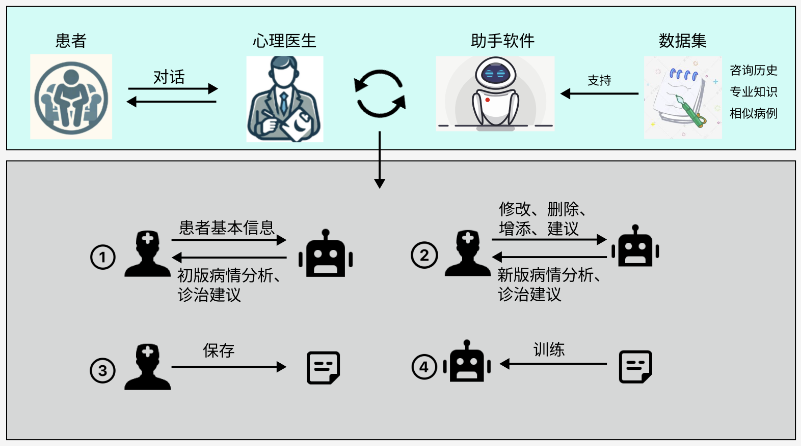
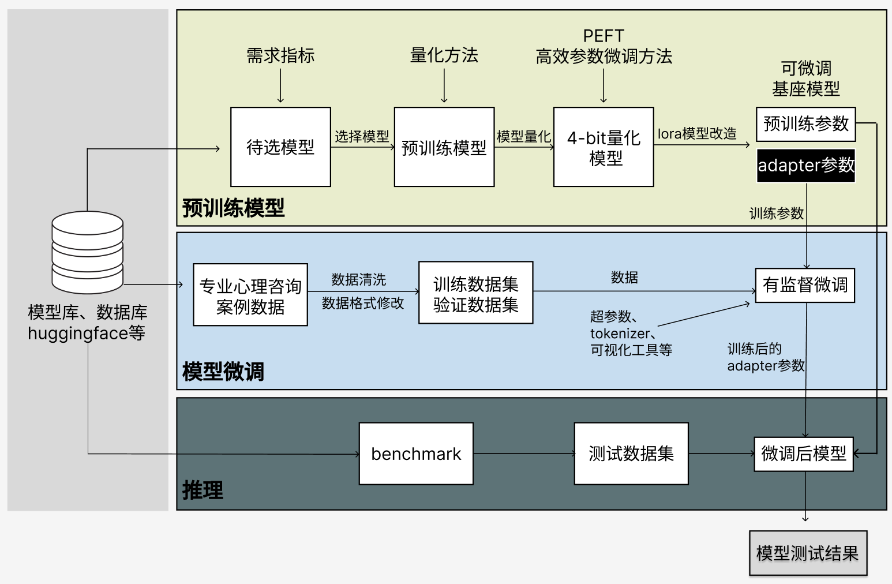
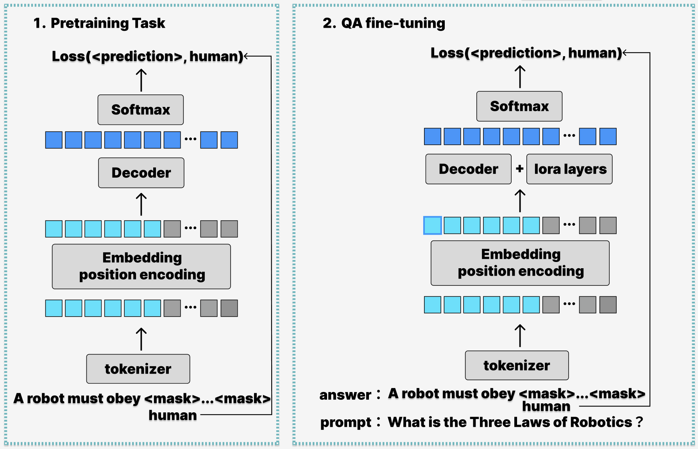
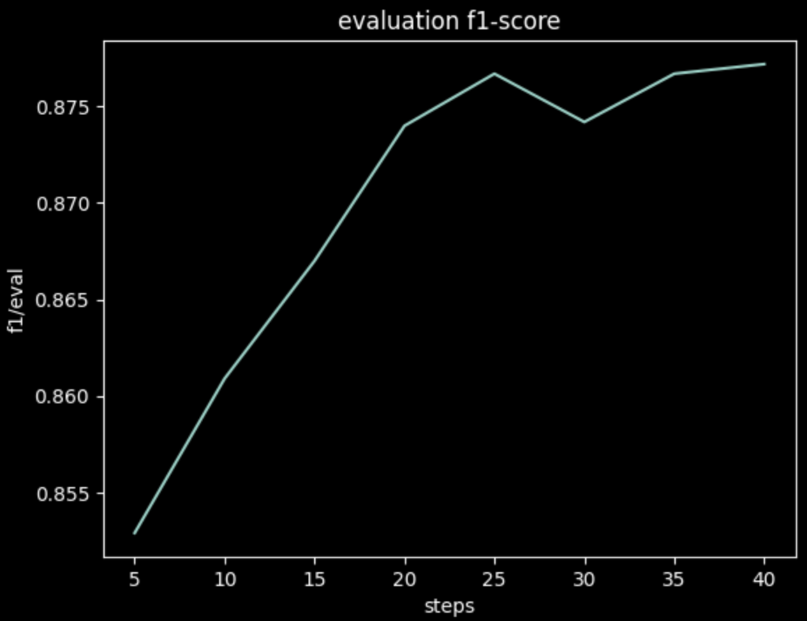
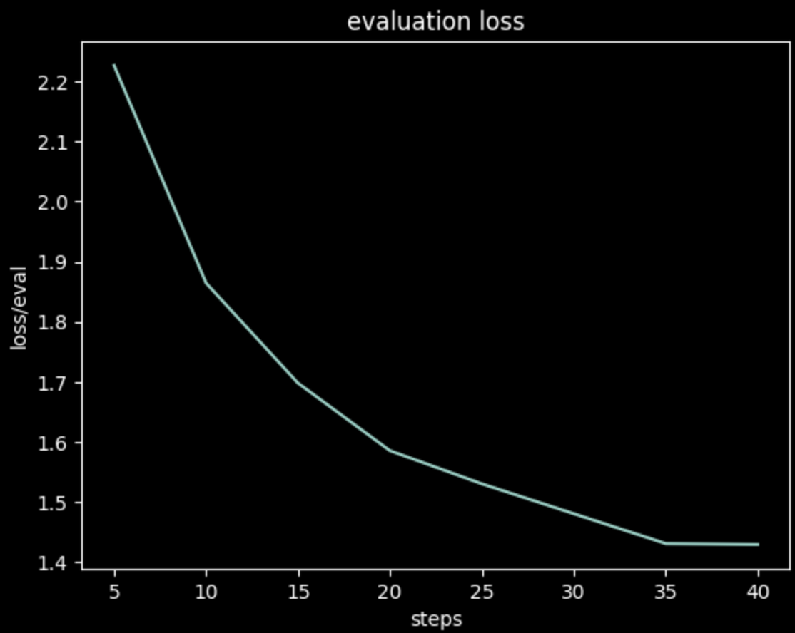
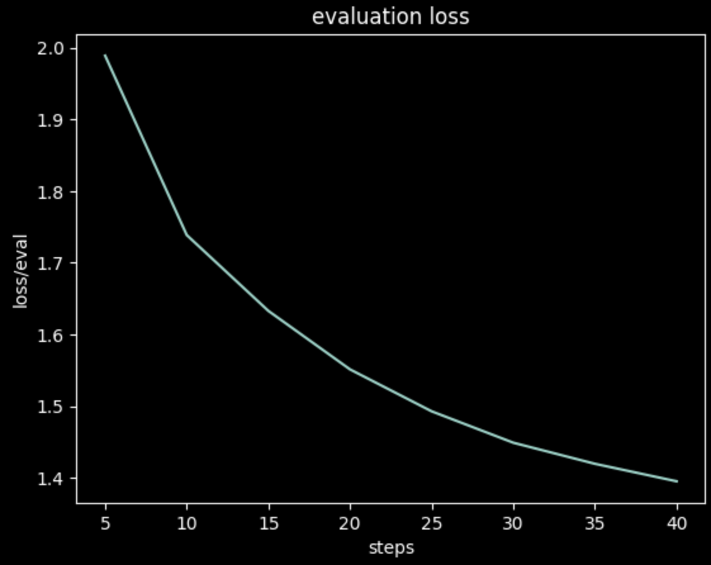
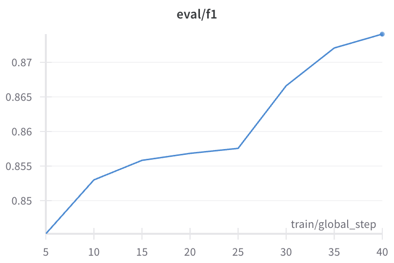
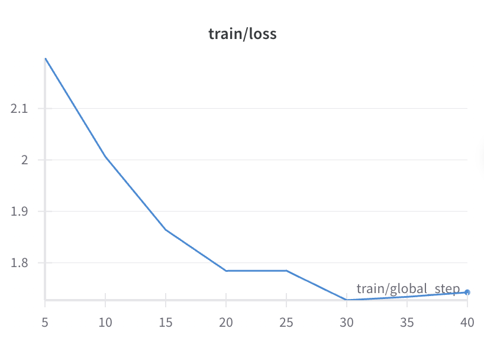
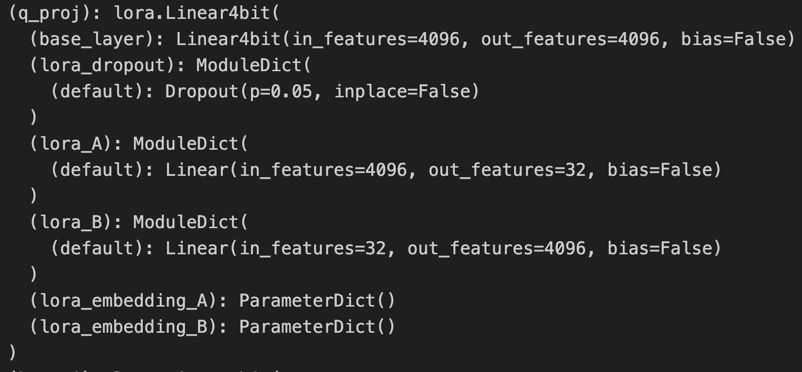

# 心理咨询软件 PhyAssist 项目文档
## 1. 软件简介
### 1.1 应用场景
我们设计和实现的软件命名为 **PhyAssist**，定位是为心理医生提供服务，作为心理咨询医生的助手，通过对话方式帮助心理医生更加简单高效地处理患者的咨询请求，给出更专业更全面的症状分析和诊治建议。 

我们的软件的设计初衷是应对当前心理咨询师在工作中可能遇到如下问题：
1. 咨询历史管理：  
在心理咨询的工作场景中，心理咨询师往往需要对多个患者同时提供长周期的咨询服务，*长周期指的是需要对同一患者提供间断性的多轮心理咨询* 。在这种情况下，每个患者的个人信息和咨询历史需要被记录下来，用作下一次咨询的参考。但是同一患者的两次咨询之间可能相差很长时间，不同患者的咨询又有可能安排的很紧。    
在上述场景中，完全依靠心理咨询师人工进行历史管理，会导致心理咨询师的大量精力会被消耗在不同患者的信息记录、查找、理解、转化的过程中，甚至导致信息管理混乱，遗失患者重要信息等后果。

2. 知识查询：  
心理咨询师对患者的症状进行分析和诊治的过程中，往往需要借助于已有的知识，但是这些知识来源广泛且繁杂：包括过往的类似病例、专业知识库、期刊文献等。如何针对患者的症状快速地查找到相关的知识，并且将其转化为对患者有用的建议，是心理咨询师需要面对的一个难题，传统的心理咨询场景中，这个难题克服完全依赖于心理咨询师的个人能力。  
但是随着心理问题的日益复杂化、知识的快速更新迭代、新的心理咨询案例不断增加，知识的查询和有效应用会成为心理咨询师提供有效诊治方案的一个瓶颈。这会限制心理咨询师专业能力的提升，也会影响患者接受的心理咨询的质量。   

我们解决问题的方法是将大语言模型的能力应用到心理咨询场景中，承担对上述提到的几种信息（个人信息、咨询历史、类似病例、相关研究等）的查询和应用工作，并进行精简归纳后呈现给心理咨询师。心理咨询师可以通过与模型的实时对话，达到 **扩充知识储备**、**高效知识查询** 的目的。

具体来说，我们的软件为心理咨询师的工作提供如下的帮助：
1. 简便、规范的信息记录工具：心理咨询师可以以十分随意的形式记录信息，甚至将患者的原始陈述一股脑地丢给软件，软件会对信息进行自动的归纳、整理、存储形成规范的笔记形式，方便心理咨询师随时查阅。能够很大程度上降低心理咨询师记录和查询的成本。
2. 高效的知识管理工具：我们的软件助手建立在大量专业心理知识和心理咨询案例之上，心理咨询师可以通过对话的方式从助手软件处查询到相关知识。这能够扩大心理咨询师的知识覆盖面，并且通过自动帮助心理咨询师完成知识的查询、整理、转化功能，降低了使用知识的成本，从而帮助心理咨询师获得专业能力的提升。

我们的应用场景如下图所示，心理咨询师通过与软件的交流，迭代出更加完善的的症状分析和诊治建议，为患者提供更加专业的心理咨询服务。
<div align = "center">
      

**Fig. 1** : 如图所示是 PhyAssist 软件的应用场景，主要过程是下半部分图中心理咨询师与助手模型的交互过程：1. 心理咨询师将与患者对话获得的基本信息输入助手模型，得到助手模型的初步分析和建议；2. 心理咨询师对助手模型的分析和建议进行修改，这个过程可以持续多轮直到心理咨询师得到满意的的诊治方案。3. 将最终的诊治方案保存到笔记中，作为患者的咨询历史。4. 使用笔记中的信息更新助手模型，以便助手模型能够更好地适应心理咨询师的使用习惯和记忆患者的历史信息。
</div>

我们的软件与目前已有的心理咨询软件的根本区别是：
* 现有心理咨询模型：试图完全替代心理咨询师，直接面向患者提供完整的心理咨询服务。
* PhyAssist：以 **助手** 作为自己的定位，它的作用只是为心理咨询师提供信息，对患者处于屏蔽状态，如下图所示。

**为何 “助手” 的定位能够更好地适应心理咨询行业的需求？**  
我们的软件的应用场景是专业的心理咨询服务，但是目前大语言模型还无法满足相应的心理咨询的专业需求，主要体现在如下几个方面：
|能力需求|描述|
| :----: | :----: |
|超长的交互式对话能力|心理咨询需要进行长时间的交互式交流，一两句话往往起不到该有的效果，但语言模型往往无法接受如此长的token输入|
|复杂的交互式对话能力|心理咨询中的交流往往相对于其他领域更加复杂。心理咨询师需要对患者的话语进行情感分析；给出的回复中需要包含理解、安慰、鼓励等多种情感元素；给出的回复不能仅仅是大话空话，要给出一针见血的建议帮助患者解决困境；心理咨询师需要反向提问或诱导，以便对患者的问题进行更深层次的挖掘等等。这种复杂的交互式对话能力是目前已有的心理咨询模型欠缺的。|
| 陪伴感和认同感|在心理咨询场景中，患者相对于一个理性的信息源，更加需要对方是一个有感情的人，能够给予患者陪伴感和认同感，能够将让患者对心中的压力进行倾诉，这一点语言模型很难进行替代。
|安全性|安全性包括两个方向，患者到模型的信息中需要对其中的一些隐私信息进行保护，同时模型生成的内容也要保证其中不包含任何不合适的内容。实际上心理咨询作为一个临床医疗行业，患者不会将自己的心理健康问题完全托付给一个模型。|

上述的问题决定了纯模型难以在专业的心理咨询场景中得到应用。但作为一个助手，模型所需要完成的任务被很大程度上简化，只需要提供大纲性质的症状分析和诊治建议供心理咨询师参考即可，与患者进行交互由心理咨询师完成。通过这种方式可以有效地模型的能力应用到心理咨询场景中。

接下来的一节中会对我们的软件的工作流程进行详细的介绍。

### 1.2 解决方案
我们软件为上一节中提出的问题给出了如下的解决方案：
>1. 使用大语言模型，接收患者信息作为输入，输出两种信息：**症状分析** 和 **诊治建议**。
>2. 为了便于心理咨询师进行查阅和修改，将这模型的输出以 **笔记** 的形式进行记录，笔记格式如下所示：
<div style="border: 1px solid black; border-radius: 10px; background-color: black; padding: 5pt; margin: 5pt; color: white; width:300pt;height:200pt;overflow:auto;
">

### Personal Basic Information
* Demographic data:
* Personal developmental history:
* Mental state:
* Physical condition:
* Social functioning:  
...  

### 1. Note1，Date: xxxx
**Counceling Question**  
xxxx

**Analysis**   
Symptom Type: xxx  
Reasons:  
1. xxxx
2. xxxx  
...       

**Advice**
1. xxxx
2. xxxx  
...   

### 2. Note2，Date: xxxx
...
</div>

>3. 为了解决长周期心理咨询历史获取的问题，我们的助手模型在向用户提供建议的时候，会将咨询历史笔记中的信息作为参考，但是这种功能仅能支持较短的历史文本（约三千到5千字）。对于咨询历史过长的情况，或者用户想构造能够适应自己患者群体的专用助手，我们提供了 **定制助手** 的服务，用户可以提供历史咨询笔记，对助手模型进行训练。
>4. 为了起到扩充知识储备的作用，我们使用大量包括心理咨询领域的 **专业知识、研究成果、经典病例** 等的数据集对模型进行了微调，使得模型能够依据这些专业知识对患者的问题进行分析和诊治建议。
>5. 为了优化使用体验，我们在模型的基础上建立了一个完善的 **人机交互系统**，在这个系统中心理咨询师可以与助手对诊治方案进行交流迭代。
>6. 为了对患者的信息进行保护，我们使用 **分布式存储技术** 对笔记进行加密存储，保证患者的隐私不会被泄露。

为方便读者理解，这里提供一个助手软件生成的诊治方案的例子。
1. **患者基本信息：**

|information|value|
|:--:|:--:|
| 人口学资料           | 孙某 (Sun), 女, 汉族, 19岁, 身高1.59米, 身材匀称、体态正常, 农村, 家境较好 |
| 个人成长史           | 高三复读学生, 前一次高考失利, 家境较好, 经历挫折事件较少, 父母期望高 |
| 精神状态             | 轻微焦虑, 失眠, 头痛, 疲劳, 注意力减退, 内心烦恼痛苦, 性格内向不主动与人交流 |
| 身体状态             | 无家族病史, 无重大躯体疾病史 |
| 社会功能             | 高三复读学生, 数学基础较差, 补习后进步不大, 性格内向不主动与人交流 |

2. **病情陈述**  
* 求助者的基本状态：  
智力发育正常，语言流畅清晰，意识清晰，情绪低落，内心痛苦。无幻觉，无智能障碍，自知力完整，有明确的求助要求。感知觉未见异常，记忆力、思维状态正常。面部表情忧郁，焦虑，情绪不稳定，自控能力基本完好，叙述的语言流畅，逻辑清晰、有层次，言行基本能保持一致。自知力完整，能主动求医。身体状态是失眠，头痛，疲劳，食欲不振。  
* 求助者陈述概要：
我是一名复读生，父母很关心我，经常到学校来看我，给我带很多好吃的，希望我能好好学习考上大学，为家族争光。但是自上次高考失利后，我学习时头总是沉沉的，书看不下去，又舍不得休息.....

3. **模型生成结果**  
Analysis:   
...   
Advice:   
...

4. **对模型生成结果的修改**  
...

5. **最终生成的诊治方案**  
...

### 1.3 软件使用手册
#### 1.3.1. 软件下载
**硬件基础条件**  
* GPU 型号：NVIDIA GeForce RTX 3090 
* 核数：2
* 显存大小：48 GiB  

** 软件库：**   
* 操作系统版本：Ubuntu 20.04.4
* 运行环境：python==3.8.10, pytorch==2.1.0-cu121

** 软件下载与安装 **
你可以通过如下方法下载我们的软件压缩包
```bash
... 未完待续 |•'-'•) ✧...
```
在本地解压后通过如下方式安装
```bash
... 未完待续 |•'-'•) ✧...
```
安装完毕后使用如下方式启动软件即可
```bash
... 未完待续 |•'-'•) ✧...
```

#### 1.3.2 产品的使用流程   
1. 开启软件后，对于每一个新患者，创建一个新的笔记，记录患者的基本信息和咨询历史；如果是一个老患者，可以直接搜索使用之前的笔记，点击 **“start”**，进入笔记窗口。
<div align = "center">
    
</div>

2. 开启笔记窗口后，软件会自动选择模型（如果针对这个患者的历史记录微调了适配器，则会默认调用这个适配器，否则会使用基础模型）。心理咨询师可以在这个过程中查看查询历史，通过对话的方式向患者了解心理问题，将患者的问题输入到对话框中，点击 **“Analysis”**，模型会生成症状分析和诊治建议。
<div align = "center">
    
</div>

3. 点击 **“Analysis”**后，会转到草稿窗口，模型生成的信息会在这里以分条的形式进行呈现。
<div align = "center">
    
</div>

4. 如上图所示，用户可以对模型生成的内容进行增添、修改、删除、点评等操作。对指定内容进行修改后，可以点击 **“regenerate”**，模型会重新生成对应的内容，用户可以通过这种方式与模型进行交互迭代，直到用户认为模型生成的内容足够满意，点击 **“save”**，将草稿保存到笔记之中。

5. 点击 **“train”**，模型会使用新增加的笔记内容，包括笔记修改时用户的偏好进行适配器的训练，从而更加适应用户的使用习惯、记忆新增加的历史信息。

6. 为了更加灵活地使用模型，我们还提供了 **Chat** 模式，用户可以摆脱软件默认的交流框架，直接与模型进行对话，获取需要的信息。
<div align = "center">
    
</div>

7. 1-5 操作通常用于生成全局性质的诊治大纲，而 **Chat** 模式可以用于快速获取更加细节、零散的信息。可以处理在与患者进行实时交流时遇到的细节问题，弥补笔记模式模式固化、效率较低的不足。

#### 3. 如何定制微调：
1. 可以使用上述 5 中提到的 **“train”** 按钮，对模型进行微调，得到一个适应于当前患者的适配器。但是在软件中提供的微调资源有限，包括限制adapter的个数、用于微调adapter的笔记长度大小等。

2. 如果用户需要在更长的笔记上进行微调服务，甚至将所有的咨询笔记作为数据集定制一个适配器，可以 ...(〃'▽'〃)未完待续...


## 2. 重现实验步骤和方法
本章节介绍了我们软件的核心，即在预训练模型的基础上进行微调得到 **助手模型** 的过程，帮助读者重现我们的实验。
<div align = "center">
    

**Fig.2** 如图所示，我们的实验分为三个步骤，（1）准备阶段：搭建基本实验环境、选择基础模型、基础模型的量化加载。（2）微调阶段：数据集的选择和预处理、模型的训练过程。（3）评测阶段：包括模型的评估过程、模型的部署过程等内容。
</div>

在本次试验中，我们进行微调的下游任务类型为 **Question Answering**，因此我们选择擅长此类任务的 **因果类语言模型**，即 **decoder-only** 模型进行微调，对于此类模型进行微调的基本原理如下：
<div align = "center">
    

**Fig.2** 如图所示，左图所示为基座模型预训练的形式：next token prediction，对于输入文本，会将当前token后面的tokens全部屏蔽掉，用前面的tokens作为输入，输出为预测单词的概率分布，将此概率分布与真实的单词的one-hot编码进行交叉熵损失计算，通过反向传播更新模型参数。右图所示为微调的形式，基本逻辑与预训练相同，只是在预训练的基础上，我们不需要对prompt部分进行损失计算，只需要对answer部分进行与预训练相同的操作，同时由于预训练采用lora方法，因此训练只更新 **lora layer** 的参数。
</div>

### 2.0 实验环境
**硬件基础条件**  
* GPU 型号：NVIDIA GeForce RTX 3090 
* 核数：2
* 显存大小：48 GiB  

**软件库：**   
* 操作系统版本：Ubuntu 20.04.4
* 训练环境：python==3.8.10, pytorch==2.1.0+cu121

**各种其他依赖库版本的依赖关系**  
```bash
evaluate==0.4.0
numpy==1.22.4
pandas==1.4.3
peft==0.7.2.dev0
scikit_learn==0.24.2
torch==2.1.0
transformers==4.36.2
gradio==4.12.0
```
简要介绍一下这些库的作用：
>* numpy：提供了大量的数学和逻辑操作以及对数组的支持，是许多科学计算库的基础。
>* pandas：数据分析库，提供了大量用于数据清洗、处理、分析和可视化的功能。
>* peft：huggface 开源的一个高效微调大模型的库。
>* scikit_learn：Scikit-learn 是一个机器学习库，提供了大量的监督和无监督学习算法。
>* torch：使用的深度学习框架。
>* transformers：Transformers提供了数以千计针对于各种任务的预训练模型模型，开发者可以根据自身的需要，选择模型进行训练或微调。
>* gradio：Gradio 是一个用于创建机器学习模型交互界面的库，可以快速地为模型创建一个 web 界面

可以使用如下方法下载项目并配置环境
```bash
git clone https://github.com/PhyAssist-project/PhyAssist_source.git
cd PhyAssist_source
pip install -r requirements.txt
```

**配置环境过程中的注意事项：**
* 可能无法正常使用 transformer 的 Trainer，在使用如下语句时报错：
```python
from transformers import Trainer
```
可能是apex包的问题
```bash
pip uninstall -y apex
```
* 无法正常使用SFTTrainer
```python
from trl import SFTTrainer
```
将typing_extensions 更改为 4.5.0版本即可
```bash
pip install typing_extensions==4.5.0
```

### 2.1 基础模型选择
我们的模型涉及到对话生成、情感分析、知识查询的任务，因此我们对基座模型的评价指标如下：
1. 由于硬件资源有限，我们对参数量大小有限制。
2. 基座模型需要具有较快的推理速度。
3. 基座模型需要适应问答生成任务，因为我们的软件的基本功能是问答。
4. 基座模型需要具有良好的文本理解能力，因为我们需要在此基础上实现对患者的症状分析。
5. 基座模型需要具有良好的常识认知能力，因为在此基础上能够更好地添加专业知识用来给出诊治建议。

考虑到成本和软件版权的问题，我们将从开源社区中选取我们的基础模型。我们的模型选取自当前最具权威性的开源大模型评价榜单 **"Open LLM Leaderboard"**。这个榜单的网址是：https://leaderboard.allenai.org/llm/submissions/public

**"Open LLM Leaderboard"** 中给出了多个针对大模型型的评测指标，我们从中选取了如下几个与我们的任务相关最相关的指标作为我们的选择标准。
|名称|作用描述|
|:--:|:--:|
|ARC| 选择题，用于评判模型 Question Answering 的能力|
|MMLU| 选择题，包括了 humanities, STEM, mathematics, US history, computer science, law 等多个领域的任务，用于评价对输入文本的理解能力|
|HellaSwag | 选择题，测评模型的常识认知能力|

我们重点关注了 **Open LLM Leaderboard** 中所有涉及到指标的平均成绩靠前的5个模型，下面的表格是这些模型关于上述四个指标的成绩、模型的参数量、模型的显存需求和模型的推理速度的统计信息。
|模型名称|Average|ARC|HellaSwag|MMLU|参数量(B)|
|:--:|:--:|:--:|:--:|:--:|:--:|:--:|
|Qwen/Qwen-72B|76.1|65.19|85.94|77.37|72.29|
|01ai/Yi-34B|75.67|65.36|85.58|76.06|34.39|
|chargoddard/internlm2-20b-llama|71.66|64.59|83.12|67.27|19.86|
|deepseek-ai/deepseek-llm-67b-base|74.7|65.44|87.1 |71.78|67|
|mistralai/Mixtral-8x7B-v0.1|75.34|67.41|86.63|71.98|46.7|

从上述几个模型的成绩中可以看出，**Qwen/Qwen-72B**、**01ai/Yi-34B**、**mistralai/Mixtral-8x7B-v0.1** 这三个模型在评价指标上的表现较好，比较适合我们的应用场景。

下面我们对这三个模型的显存需求进行了测试，发现即使使用最大程度的4-bit量化，我们的显存资源也无法满足 **Qwen/Qwen-72B**，因此我们将其排除在外。

接下来我们详细了解了 **01ai/Yi-34B** 和 **mistralai/Mixtral-8x7B-v0.1** 这两个模型的结构和特点，发现二者的主要优势分别为：
* **01ai/Yi-34B**：模型的参数较小，显存需求较低，支持 200K 超长上下文窗口，汉语支持较好
* **mistralai/Mixtral-8x7B-v0.1**：模型使用了稀疏的专家混合网络结构，推理速度快（与12.9B大小的模型推理速度相当）。    
二者都提供了成熟的量化版本、对话模型、微调指南等资源，可以方便我们的使用。

我们最终选择了 **mistralai** 新推出的 **Mixtral-8x7B** 作为我们的基座模型。模型的参数量为46.7B，结构是mistralai系列提出的**稀疏的专家混合网络**，在控制参数量规模并且提升模型推理速度的同时，性能也相对较优。

注：实验中实际使用的模型 **Mistral-8x7B-Instruct-v0.1** 是在 **Mixtral 8x7B** 的基础上通过监督微调和直接偏好优化(DPO)进行优化后的版本，以让之能够更加严格地遵循指令输入格式，模型结构完全相同，只是参数不同。相对于 **Mixtral 8x7B**，**Mixtral 8x7B Instruct** 在多个测试集上的表现有所提升。

如想要进一步了解 Mixtral 8x7B模型，可以查看原论文，论文地址：
https://arxiv.org/pdf/2401.04088.pdf 

除了 **Mistral-8x7B-Instruct-v0.1** 之外，我们还使用了 **01ai/Yi-34B** 作为对比模型，进行同样的微调试验，用于将两个模型的效果进行对比。模型的效果可以在 2.4.8 节中进行查看。

### 2.2 数据集和预处理
#### 2.2.1 数据集选择：
根据我们的应用场景，我们需要的数据格式为 **（问题-分类-分析-建议）** 的三元组：
<div style="border: 1px solid black; border-radius: 10px; background-color: white; padding: 5pt; margin: 5pt; color: black; width:300pt;height:200pt;overflow:auto;
">

**Counceling Question**  
* 求助者的基本状态：  
智力发育正常，语言流畅清晰，意识清晰，情绪低落，内心痛苦。无幻觉，无智能障碍，自知力完整，有明确的求助要求。感知觉未见异常，记忆力、思维状态正常。面部表情忧郁，焦虑，情绪不稳定，自控能力基本完好，叙述的语言流畅，逻辑清晰、有层次，言行基本能保持一致。自知力完整，能主动求医。身体状态是失眠，头痛，疲劳，食欲不振。  
* 求助者陈述概要：
我是一名复读生，父母很关心我，经常到学校来看我，给我带很多好吃的，希望我能好好学习考上大学，为家族争光。但是自上次高考失利后，我学习时头总是昏沉沉的，书看不下去，又舍不得休息。上课很容易就会开小差，注意力无法集中，经常担心考不上大学怎么办。特别是考试时，“怕比其他人考得差”的念头总在头脑里不断闪现。又想到比其他同村同学多读了一年，如考不上大学，不仅无颜见江东父老，而且丢尽了家族的脸。我总是在想如何能把学习成绩提高上去，因为怕休息会耽误时间而影响我的学习成绩，有时教室和宿舍的灯熄了我就在路灯下继续学习。考试前较长一段时间就很紧张，总担心比其他人考的差。因为考前的紧张感加剧，所以三个月来每次考试成绩都不理想，并且逐渐下降，这令我更加焦虑。考试时心慌，手发抖，小便急，全身绷紧而影响考试成绩。成绩不好我内心非常痛苦，特别是数学，每次想到都能落泪，自己是复读生，又不好意思向同学请教。


**Analysis**   
Symptom Type: 学业焦虑
Analysis:   
1. 学业压力： 求助者作为复读生，父母期望较高，经济、家族荣誉等多方面的压力。
2. 情绪困扰： 失利后出现头痛、失眠、食欲不振等身体症状，表明情绪困扰较为显著。
3. 自我要求： 对自己有很高的要求，害怕考试时与他人相比不如人，考试成绩引起强烈的内疚和痛苦。
4. 社会压力： 担心丢脸、影响家族名誉，对比同村同学的差距感到焦虑。
5. 学习方式： 在灯光充足的地方学习，甚至在夜间继续学习，表现出过度努力以求成功。

Advice:  
1. 心理评估： 进行深入的心理评估，了解更多求助者的内在需求和压力来源。
2. 心理治疗： 提供认知行为疗法（CBT）等心理治疗，帮助求助者理解和改变负面的学业观念和情绪反应。
3. 情绪调节： 教授情绪调节技能，帮助求助者更好地处理考试压力和情绪困扰。
4. 学习方法： 协助求助者建立更有效的学习方法，避免过度努力和疲劳。
5. 家庭沟通： 开展家庭会谈，协助家庭理解求助者的压力，并共同制定更合理的学业规划。
6. 身体状况关注： 指导求助者关注身体健康，调整作息，提高睡眠质量。 
</div>

构建目标数据集用到的原始数据资源：
|数据集名称|数据集来源|数据集大小（条）| 数据集描述 | 下载地址 |
|:--:|:--:|:--:|:--:|:--:|
| DR | IMHI | 600 | 抑郁症症状咨询及分析| https://github.com/SteveKGYang/MentalLLaMA.git |
| dreaddit | IMHI | 600 | 压力过大症状咨询及分析| 同上|
| Irf | IMHI | 600 | 人际危险因素咨询及分析 | 同上|
| MultiWD| IMHI | 600 | 多因素心理问题咨询及分析| 同上|
| SAD | IMHI | 600 | 导致压力的原因分析| 同上|
|counsel_chat| nbertagnolli | 2000 | 心理问题咨询及建议| https://huggingface.co/datasets/nbertagnolli/counsel-chat |

下载完成后，可使用如下方法，将数据集转化为我们训练任务所需的格式：
... 未完待续 |•'-'•) ✧...
也可以直接下载我们已经处理好的数据集，地址为：
... 未完待续 |•'-'•) ✧...

#### 2.2.2 数据预处理
我们对于数据的预处理工作主要分为两部分：1. 对数据的清洗；2. 对数据的格式转换。
1. 对数据的清洗：将空数据、过长的数据、含有网址的数据、含有特殊字符的数据等去除。
2. 对数据的格式转换：将数据转换成基座模型要求的格式，否则会导致模型无法正常训练或者效果的显著降低。主要的工作是进行特殊字符的添加，区别输入和输出部分，在微调计算损失时会忽略输入部分。
    Mistral_instruct 模型的文档中给出的格式为：
    ```
    <s> [INST] Instruction [/INST] Model answer</s> [INST] Follow-up instruction [/INST]
    ```
    其中 **<s>**、**</s>**标记文本的开始和结束，**[INST]** 和 **[/INST]** 用于标记用户的输入。
    标记后的数据格式如下：
    <div style="border: 1px solid black; border-radius: 10px; background-color: white; padding: 5pt; margin: 5pt; color: black; width:300pt;height:200pt;overflow:auto;">

    **\<s\> [INST]**  
    **Counceling Question**    
    xxxx  
    **[/INST]**  
    **Analysis**     
    Symptom Type: xxx    
    Reasons:    
        1. xxxx  
        2. xxxx    
    ...       

    **Advice**  
        1. xxxx  
        2. xxxx    
    ...     
    **\</s\>**   
    </div>
    
对于数据的清洗和格式转换可以通过gen_csv.py完成，**"<source_data_path>"** 在IMHI数据集中指定为 **"train_data/instruction_data/dataset_name.csv"**，在counsel_chat数据集中指定为 **"nbertagnolli_dataset/counsel_chat.csv"**。
```bash
    gen_csv.py --origin_path <source_data_path> --new_path <output_path>
```
在完成预处理后的数据会以csv文件的格式保存在指定的 **"<source_data_path>"** 路径下。

### 2.3 训练模型的软件框架
#### 2.3.1 SFTTrainer
Transformers中为我们封装好了一个很完善Trainer类，用来承担对模型的训练任务，SFTTrainer是Trainer的一个子类，专门用于有监督的微调。

SFTTrainer在训练时可以提供很多对训练的优化功能，比如梯度累积、梯度裁剪、学习率调度器、学习率线性预热、AdamW优化器、模型检查点等等，这些功能都可以通过Trainer的参数进行配置。

使用SFTTrainer能够大大简化我们的训练代码。

SFTTrainer中的使用方法和参数设置可以查看官方文档：  
https://huggingface.co/docs/trl/main/en/sft_trainer

#### 2.3.2 peft
peft(Parameter efficient fine-tuning)是一个用于模型参数量化的库，其中提供的功能主要用于降低训练过程中的显存占用。

我们是用了库里面提供的lora方法（Low Rank Adapter）降低微调的参数量，Lora的基本思想就是在预训练模型进行微调以适应下游任务时，将模型本身的参数进行冻结，转而训练一个低秩矩阵，以达到控制训练参数量的目的。

值得注意的是，使用lora方法改造模型后，微调出来的结果（低秩矩阵的集合，被称为Adapter）相对于模型是独立的，因此可以随时将Adapter添加到模型中，也可以随时将Adapter从模型中移除。这赋予了Adapter很强的灵活性，可以根据需要随时添加或移除Adapter，也可以在同一基座模型上安装不同的Adapter，让它能够适应不同的下游任务。

在使用peft库对模型进行量化后，需要微调的参数量得到了大幅度的减少。
```bash
trainable params: 31465472 || all params: 23514066944 || trainable%: 0.13381552444728806
```

peft的具体原理和使用方法可以参考：  
https://github.com/huggingface/peft  

#### 2.3.3 accelerate
accelerate是一个用于模型并行训练的库，它能够很方便地将PyTorch代码在任何分布式配置下运行，由于我们的实验环境要使用两个GPU，并且单个GPU无法存储整个模型，因此需要accelerate库的支持。

在使用accelerate库后，我们成功地将模型的参数均匀加载到了两个GPU上，并且在训练过程中显存需求也相对均匀地由两个显存负担。在训练过程中，两个显存的利用率基本都达到了90%以上。

acclerate库的简单介绍可以参考huggingface的文档  
https://huggingface.co/docs/accelerate/index

#### 2.3.4 bitsandbytes
bitsandbytes是一个用于模型量化的库，它提供了很多种量化方法，包括4-bit量化、8-bit量化等等，它可以通过降低在存储过程中模型参数的精度来降低模型的显存需求。

在实验过程中，我们可以通过配置bitsandbytes库中的参数在加载进内存对模型进行量化，并且实现对量化后模型的正常训练。

在使用模型量化后，成功将有46.7B参数量的模型压缩至27.6GB显存存储，原预训练模型参数文件的大小为96.8GB，压缩后模型大小约为原模型的28%。

bitsandbytes库的使用方法可以参考：
https://huggingface.co/docs/transformers/main/en/quantization#bitsandbytes

#### 2.3.5 wandb
wandb是一个免费的，用于记录实验数据的工具。wandb相比于tensorboard之类的工具，有更多的功能，比如可以记录实验的环境配置、运行时间、损失变化、精度变化、学习率变化、显存占用、GPU功耗等信息。

在使用wandb后，我们可以很方便地记录和查看实验中的细节。

#### 2.3.6 gradio
gradio是一个用于构建交互式界面的库，它可以很方便地将我们的模型部署到网页上，让用户可以通过网页与模型进行交互。

在完成模型的训练之后，我们可以使用gradio建立一个简单的网页，通过这个网页检测模型的效果。

我们在项目中使用了gradio库编写了一个简单的demo，可以在demo.ipynb中运行，运行此代码需要完成整个环境的配置过程和模型的训练过程。

gradio库的使用方法可以参考：
https://www.gradio.app/docs/interface

### 2.4 训练模型的过程
本节通过 Mistral_Fine_Tune.ipynb 的代码来重现我们的训练过程。
#### 2.4.0 环境检查
检查各种依赖库是否安装成功，GPU是否正常工作
```python
from transformers import AutoModelForCausalLM, AutoTokenizer, BitsAndBytesConfig, TrainingArguments,pipeline, logging, TextStreamer
from peft import LoraConfig, prepare_model_for_kbit_training, get_peft_model
import torch, warnings
from datasets import load_dataset
from trl import SFTTrainer
torch.cuda_is_available()
```
```bash
True
```

#### 2.4.1 加载基座模型
AutoModel 是 huggingface 提供的一个类帮助我们自动快速下载模型，我们可以使用如下代码下载模型。
<details>
<summary>点击以展开代码</summary>

```python
from transformers import BitsAndBytesConfig, AutoModelForCausalLM

# 基座模型在huggingface仓库中的名称
base_model = 'mistralai/Mixtral-8x7B-Instruct-v0.1' 

# 使用BitsAndBytes库对模型进行4-bit量化
bnb_config = BitsAndBytesConfig( 
    load_in_4bit= True,
    bnb_4bit_quant_type= "nf4",
    bnb_4bit_compute_dtype= torch.bfloat16,
    bnb_4bit_use_double_quant= False,
)
# from_pretrained方法自动加载模型
model = AutoModelForCausalLM.from_pretrained(
        base_model,
        quantization_config=bnb_config,
        device_map="auto", # accelerate 库提供的功能，使用多个GPU加载模型参数
        trust_remote_code=True,
)
```
</details>
判断模型是否加载成功，可以直接打印出模型的结构  

```python
print(model)
```
```bash
MixtralForCausalLM(
  (model): MixtralModel(
    (embed_tokens): Embedding(32000, 4096)
    (layers): ModuleList(
      (0-31): 32 x MixtralDecoderLayer(
        (self_attn): MixtralAttention(
          (q_proj): Linear4bit(in_features=4096, out_features=4096, bias=False)
          (k_proj): Linear4bit(in_features=4096, out_features=1024, bias=False)
          (v_proj): Linear4bit(in_features=4096, out_features=1024, bias=False)
          (o_proj): Linear4bit(in_features=4096, out_features=4096, bias=False)
          (rotary_emb): MixtralRotaryEmbedding()
        )
        ...
```

#### 2.4.2 peft模型量化
使用peft库对模型进行转换，降低模型的参数量。
```python
from peft import LoraConfig, prepare_model_for_kbit_training, get_peft_model
model = prepare_model_for_kbit_training(model) # 做一些准备工作，将量化模型转换为适合进行Lora微调的模式
lora_alpha = 8 
lora_dropout = 0.05 
lora_rank = 16

peft_config = LoraConfig(
    lora_alpha=lora_alpha,
    lora_dropout=lora_dropout,
    r=lora_rank,
    bias="none",
    task_type="CAUSAL_LM",
    target_modules=["q_proj", "k_proj", "v_proj", "o_proj", "gate"]
)
# get_peft_model returns a Peft model object from a model and a config.
model = get_peft_model(model, peft_config) # get_peft_model：用于创建一个 PeftModel 类型的模型

```
涉及到的关键参数如下表：
|参数名称|作用描述|取值范围|参数取值对训练的影响|推荐参考值
|:--:|:--:|:--:|:--:|:--:|
|lora_alpha|缩放因子，低秩矩阵叠加到原模型参数中时，需要乘以这个缩放因子。||一般设置为r的两倍会获得最好的训练效果|8|
|lora_dropout|Lora层的丢失概率，对于AB两个参数矩阵也要进行dropout用于正则化。|||0.05|
|r|低秩矩阵的秩。|[4,8,16,32,64]|较低的值就可以取得比较好的训练效果，较大的值也不一定会获得更好的效果|16|
|task_type|任务类型|||因为本次实验是因果语言模型，因此设置为CAUSAL_LM|
|target_modules|需要进行低秩分解的模型参数矩阵，一般设置为原模型中的一些 **线性层**，这些层的名字可以通过 ```model.named_parameters``` 来获取。|所有的线性层的名字|覆盖到尽可能所有的线性层微调效果更好|对于我们的模型，可以进行低秩分解的参数矩阵有 **q_proj、k_proj、v_proj、o_proj、gate** 。|


当修改完毕之后，可以使用下面的代码来检查模型可训练的参数量。
```python
model.print_trainable_parameters()
```
```bash
trainable params: 31465472 || all params: 23514066944 || trainable%: 0.13381552444728806
```

#### 2.4.3 加载Tokenizer
Tokenizer是NLP大模型最基础的组件，用于将数据由文本转换成向量，成为模型可以接受的输入形式，需要将它传递给SFTTrainer。

huggingface中的模型项目中都会提供一个 tokenizer.config 文件，Transformers库中AutoTokenizer类会根据这个文件中的配置来构建出对应的分词器，代码如下所示：
```python
from transformers import AutoTokenizer
tokenizer = AutoTokenizer.from_pretrained(base_model, trust_remote_code=True)
```

加载成功后，可以通过如下代码来检查分词器的效果：

```python
output = tokenizer.encode("你好呀")
print(output)
print(tokenizer.decode(output))
```

```bash
[1, 28705, 29383, 29530, 232, 148, 131]
<s> 你好呀 </s>
```


#### 2.4.4 加载数据集
使用huggingface提供的datasets库来加载数据集，<output_path>代表预处理后的数据集的存储位置，代码如下所示：
```python
from datasets import load_dataset
data_path = <output_path>
dataset = load_dataset('csv', data_files = data_path, split="train")
dataset
```
加载成功后打印结果如下：    
```bash
Dataset({
    features: ['text'],
    num_rows: 825
})
```

#### 2.4.5 配置训练参数
通过TrainingArguments类来配置训练参数，并传递给SFTTrainer，各个参数的用途可以参照注释，详细作用可以查看SFTTrainer的文档，代码如下所示：
<details>
<summary>点击以展开代码</summary>

```python
output_dir = "./mistral7b_nbertagnolli"
per_device_train_batch_size = 4 # reduce batch size by 2x if out-of-memory error
gradient_accumulation_steps = 4  # increase gradient accumulation steps by 2x if batch size is reduced
optim = "paged_adamw_32bit" # activates the paging for better memory management
save_strategy="steps" # checkpoint save strategy to adopt during training
save_steps = 20 # number of updates steps before two checkpoint saves
logging_steps = 20  # number of update steps between two logs if logging_strategy="steps"
learning_rate = 2e-4  # learning rate for AdamW optimizer
max_grad_norm = 0.3 # maximum gradient norm (for gradient clipping)
max_steps = 660 # training will happen for 320 steps
warmup_ratio = 0.03 # number of steps used for a linear warmup from 0 to learning_rate
lr_scheduler_type = "constant"  # learning rate scheduler 

training_arguments = TrainingArguments(
    output_dir=output_dir,
    per_device_train_batch_size=per_device_train_batch_size,
    gradient_accumulation_steps=gradient_accumulation_steps,
    optim=optim,
    save_steps=save_steps,
    logging_steps=logging_steps,
    learning_rate=learning_rate,
    fp16=True,
    max_grad_norm=max_grad_norm,
    max_steps=max_steps,
    warmup_ratio=warmup_ratio,
    group_by_length=True,
    lr_scheduler_type=lr_scheduler_type,
    # push_to_hub=True,
)
```
</details>

涉及到的关键参数如下表：

|参数名称|作用描述|参数取值对训练的影响|推荐参考值|  
|:--:|:--:|:--:|:--:|
|optim|优化器，能够让训练变得更加平滑，减缓损失震荡||"paged_adamw_32bit"|
|per_device_train_batch_size|每个GPU上的训练批量大小|较大的值会导致显存不足，较小的值会导致训练时间增加，并且训练损失波动较大|4|
|gradient_accumulation_steps|梯度累积步数，规定多少次正向传播积累梯度后进行一次反向传播，用于在不增加显存同时增加batch_size||4|
|learning_rate|学习率|较大的值会导致训练不稳定，较小的值会导致训练时间增加|2e-4|
|max_grad_norm|梯度裁剪的最大值|较大的值会导致梯度爆炸，较小的值会导致梯度消失|0.3|
|max_steps|训练的步数|较大的值会导致训练时间增加，较小的值会导致模型欠拟合|可以根据数据集大小，和训练的预期时间进行设置|
|warmup_ratio|预热训练的步数比例，有助于减缓模型在初始阶段对mini-batch的提前过拟合现象，保持分布的平稳||0.03|


#### 2.4.6 开启 wandb 记录训练过程
运行下面的代码后，会自动将训练过程记录到wandb的网站上，返回True代表登陆成功。
```python
import wandb
wandb.login()
# True
```

#### 2.4.7 开启训练
使用SFTTrainer的train方法来开启训练，代码如下所示：
```python
trainer = SFTTrainer(
    model=model,
    train_dataset=dataset,
    peft_config=peft_config,
    dataset_text_field="",
    tokenizer=tokenizer,
    args=training_arguments,
    packing= True,
)
trainer.train(resume_from_checkpoint=True)
```
开启训练后如果观察到如下输出，证明训练过程成功被记录到wandb上。
<div align = "center">
    
</div>
观察到训练的进度条出现，且损失开始逐步下降，证明训练过程正常进行。
<div align = "center">
    
</div>
当训练达到指定的步数后，训练会自动停止，同时会自动保存adapter的参数、配置信息等，保存在指定的output_dir文件夹下，命名为“checkpoint-step_num”，证明训练过程正常结束。

#### 2.4.8 训练结果
本节展示 **Mistral-8x7B-Instruct-v0.1** 与 **01ai/Yi-34B** 两个模型在数据集 **IMHI-DR** 训练结果，包括：
1. 模型的训练损失变化
2. 模型的验证损失变化
3. 模型在验证集上的 bertscore (f1值)

<div align = "center">

|模型名称|f1|train-loss|val-loss|
|:--:|:--:|:--:|:--:|
|**Mistral-8x7B-Instruct-v0.1**|  | ||
|**01ai/Yi-34B**|  | ||
    
两个模型在数据集 **IMHI-DR** 上的训练结果，使用两个GPU，训练的优化器为**paged_adamw_32bit**，训练学习率为2e-4，批量大小为8，共训练了8个epoch，预热训练的步数比例为0.03。

</div>  

### 2.5 模型的测试
在本次试验中，使用了 IMHI 项目中提供的测试平台进行测试，测试的内容是模型的核心功能之一：根据病情陈述输出病情分析的能力（分析包括判断出患者心理疾病的类型，以及给出如此判断的原因）。

测试分为两部分：模型输出的精确度和质量，分别对应了两个指标：F1和BartScore。前者表示模型生成的文本与金标准答案的重合度，表示是否正确预测出患者的心理问题类型并给出合理分析，后者表示模型生成的文本的质量，即是否通顺、是否符合语法等。

<div align = "center">

Model    |  Param. |   DR | Dreaddit | IRF |  MuliWD | 
|:---:|:---:|:---:|:---:|:---:|:---:|
|SADLLaMA-7B  |7B   | 58.91  | 3.51  |  38.02   |  40.1| 11.04 |
|LLaMA-13B  | 13B  |  54.07  | 36.28  | 38.89  | 53.65  |  13.2 |
|ChatGPT  |    175B  | **82.41**  | 71.79  | 41.33 |  62.72 | 54.05|
|GPT-4  | 175B  | 82.0  | **78.18** | 51.75  | 62.58  |  55.68|
|Gemini Pro | Unknown | 74.81  | 45.17 | 57.23  | **73.33**  |  61.92|
|PsyAssist   |   46.7B  |  76.88   | 77.37  |  **61.23**  |  66.61   | 55.58|

*测试结果及对比数据如图所示，其中 **DR、Dreaddit、IRF、MultiWD、SAD** 分别代表了五个测试集，纵坐标为用于对比的模型，对应的分数为在此测试集上的 F1 值。可见我们的模型在每个数据集上的评测指标都接近或超过了其他模型，其中在IRF数据集上的表现最为突出。*
</div>

在mistralai_test.ipynb中给出了测试的代码，包括加载模型并用模型做推理的方法，以及如何使用MentalLLama的测试平台进行测试。具体测试平台的使用方法详见 MentalLLama 项目的文档：https://github.com/SteveKGYang/MentalLLaMA.git

关于模型在实际部署到软件后的使用性能的测试，我们计划在后续的工作中进行。

### 2.6 模型的发布
在完成了模型的测试之后，就可以将模型发布到 huggingface 中，huggingface提供了一个模型发布的平台，可以将模型发布到平台上，方便其他人使用。

发布模型需要首先登陆 huggingface 的账号
```python
from huggingface_hub import notebook_login
notebook_login()
```
接下来将需要发布的模型按照4.1中的方法进行加载，加载完成后的模型直接使用push_to_hub函数即可发布到 huggingface 平台上，比如下面的代码就向huggingface中推送了idegroup/PhyAssist模型。
```python
# 第一个参数为模型名字，第二个参数为你所属的组名
model.push_to_hub("PhyAssist", organization="idegroup")
```
值得注意的是，由于我们训练出来的模型以adapter的形式存在，因此在发布模型时只需要将adapter的参数进行上传，而不需要上传基座模型的参数信息，只需要上传所使用的基座模型的配置信息即可，在使用我们的模型时，huggingface会根据配置信息自动下载基座模型，然后将adapter加载到基座模型中。这方便了我们进行模型的发布，也方便了其他人使用我们的模型，因为adapter相对于整个模型来说，体积很小，上传和下载的速度都很快。

在上传了模型之后，就可以从 huggingface 平台上获得模型了，下载方法如下：
```python
from transformers import AutoModelForCausalLM
model = AutoModelForCausalLM.from_pretrained("idegroup/PhyAssist")
```

### 2.7 开发应用系统
我们已经将模型推送至huggingface，模型的网址是 https://huggingface.co/idegroup/PhyAssist ，可以通过huggingface的API来加载模型，使用模型进行推理。  

初步的应用系统可以使用gradio库来实现，使用gradio库可以很方便地构建一个简单但功能完善的网页，来进行模型的测试和展示。我们的项目中提供了一个示例程序demo.ipynb，用户可以仿照这个程序来构建自己的应用系统。

### 2.8 部署应用
关于部署应用到，比较简单的方案是直接使用gradio中的功能将应用部署到huggingface提供的项目托管平台，就可以生成一个可公开使用的Gradio在线应用，供他人使用，每个项目空间免费配备8个CPU核和16GB运行内存，但是GPU资源需要单独付费。

具体的部署方法详见官方文档：
https://huggingface.co/docs/hub/spaces-sdks-gradio

### 2.9 常见问题处理
#### 2.9.1. 从hugging face中下载模型或者数据时可能遇到无法翻墙的问题
可以使用镜像网站 https://hf-mirror.com，使用如下命令可以将所有transformers库的下载地址设置为镜像网站。
```bash
HF_ENDPOINT=https://hf-mirror.com 
```
#### 2.9.2. 如何知道模型需要的训练数据格式？
一般在huggingface模型项目的文档中会对训练数据格式进行介绍，如果没有找到的话就可以到还可以到项目文件中的 tokenizer_config.json 文件中查看tokenizer的配置，其中的 **chat_template** 字段一般会tokenizer的输入格式，也就是训练数据所需要的格式
```json
"chat_template": "{{ bos_token }}{% if (message['role'] == 'user') != (loop.index0 % 2 == 0) %}{{ raise_exception('Conversation roles must alternate user/assistant/user/assistant/...') }}{{ '[INST] ' + message['content'] + ' [/INST]' }}{{ message['content'] + eos_token}}{{ raise_exception('Only user and assistant roles are supported!') }}"
```
#### 2.9.3. 在构建peft中的LoraConfig，如何指定合适的target_modules，即用lora层替换的目标层？ 
需要进行低秩分解的模型参数矩阵，应该设置为原模型中的一些关键层，这些层的名字可以通过python命令进行查看：```print(base_model.named_parameters)``` 如下图，可以进行低秩分解的参数矩阵有 q_proj、k_proj、v_proj、o_proj、gate 等。


#### 2.9.4. 在训练过程中遇到的梯度不下降的问题
在训练的时候，我遇到了训练梯度不下降的问题。

对于大模型的微调来说，在时间有限的情况下，往往需要在训练数据集的规模和训练轮数之间做出取舍。我第一开始使用了包含很多数据的数据集进行训练，但很长时间才能训练完一轮，在epoch轮数较少的情况下，模型对下游任务的适应能力并没有显著提升，损失也一直维持在1.5左右波动，因此我将数据集的规模进行缩小，转而训练更多的epoch，观察到模型的损失得到了显著的下降。

因此我认为可以让模型多训练几轮，而不是一味地增加数据集的规模，对于模型适应下游任务的能力更有帮助，可能是因为微调的目的是让模型学会下游任务的回答范式，对典型的几个回答范式进行多次训练，比对大量的回答范式进行少次训练更有帮助，且由于大模型本身已经进行了大量的预训练，因此不用太过担心大模型会出现太明显的过拟合的情况。

上述还只是一些经验之谈，没有什么理论依据，要搞清楚的话后续还需要进一步研究。对于本实验来说，无疑需要更多的训练数据来进一步提升模型的效果，这也是后面需要完善的地方。

#### 2.9.5. 在训练过程中遇到的显存不足的问题
在训练过程中，由于模型的参数量很大，因此在训练过程中会遇到显存不足的问题，这时候可以通过如下几种策略将模型的内存需求减少：
1. **减少batch_size**：这种方法会导致训练速度的下降，因此需要在batch_size和训练速度之间做出取舍。  
    使用方法：在TrainingArguments中设置per_device_train_batch_size参数。
2. **梯度检查点 Gradient Checkpointing**：在正向传播的过程中设置检查点，只保存检查点处的中间结果，其余中间结果在反向传播时从最近的检查点开始重新计算，减少内存使用的同时也会导致训练速度的下降。
    使用方法：在TrainingArguments中设置gradient_checkpointing=True。
3. **梯度积累**：多次正向传播积累梯度后再进行一次反向传播，这样可以减少反向传播的内存占用，但会导致训练速度的下降，相当于将一个batch的训练分成了多个小batch进行训练。
    使用方法：在TrainingArguments中设置gradient_accumulation_steps参数。
4. **模型量化**：将模型的参数转换为低精度的形式，可以大幅度减少模型的内存占用，但会一定程度上导致模型的精度下降。
    使用方法：使用**bitsandbytes**库进行模型量化，具体使用方法参考 **2.1.3 基座模型的下载**
5. **lora**：使用lora进行模型的低秩分解，可以大幅度减少模型的内存占用。
    使用方法：使用**peft**库进行模型的低秩分解，具体使用方法参考 **2.3.2 peft**


#### 2.9.6. 如何将训练出来的多个adapters进行合并
在进行实验的过程中，由于训练出来了多个adapter，因此在使用时需要将多个adapter进行合并，但是lora的特征是每个adapter可以叠加到原始模型中获得微调模型，但是多个adapter叠加到一起就可能彼此干扰，因此目前还没有找到比较好的方法将多个adapter进行合并。    
最简单的方式是在训练的时候将所有涉及到的数据集进行合并，合并到一起后训练出来一个完整的adapter，这也是后来我们采用的方式。

## 3. 项目总结
在本项目中，我们为解决心理咨询师在工作中常见的两个问题：**如何高效管理患者数据**、**如何扩充知识储备**，提出了一个解决方案：**使用大模型进行微调，构建一个心理咨询师助手**。

我们实现了将47B参数量的基座模型在两个27GB的GPU上微调的过程，并完成了在IMHI benchmark上的测试，测试结果表明我们的模型在多个测试指标上超过了当前最先进心理咨询模型的水平，证明了我们的模型在下游任务上的有效性。

我们还以我们的模型为核心构建出来了一个完整的应用，实现了本文档开头所描述的功能，初步具备了在实际应用的能力。用户试用的结果显示我们的应用具备了在心理咨询领域帮助心理咨询师进行数据整理、探讨方案的能力，但模型给出内容的专业性还需要进一步提升。

在本项目中，我们还从专业心理咨询案例中构建出来一个数据集，格式为 **"问题-分析-建议"**，可以用作后续工作的基础，也可以用于其他相关研究的参考。

在本文档中，我们分享了关于大模型在下游任务中微调的一些经验，包括构建数据集、选择模型、模型训练、简单应用的发布部署等等，这些经验可以帮助后续的研究者更好地进行相关研究。

本文档可以用作后续在其他任务上进行大模型微调的参考，关于一个以大模型为基础的项目，也可以参考本文档的结构和内容进行编写。其中 2.3节和2.4节的内容基本上可以在对示例代码进行修改后套用，其余部分可以借用标题框架，将内容替换为自己的内容即可。

## 4. 存在的问题和改进方向
### 4.1 文字、图表等形式的表达清晰准确性。


### 4.2 待深入研究的问题

### 4.3 如何提升软件能力和易用性

### 4.4 未完成的任务记录
本文档涉及到的项目还没有完成，因此文档中的部分内容残缺，在此记录一下。
1. 1.2: 诊治方案的例子部分，需要对 “Advice”和“Analysis”部分进行补充
2. 1.3: 需要设计出一个完整的成品软件，然后补充这里面安装部署的方法
3. 2.1: 大模型分类树没有构建出来。。。
    * 不了解大模型具体的分类，以及每个类别适合哪一类任务
    * 不知道 对话和问答任务 是属于哪一类的，还是所有模型都可以做？
    * 在下游任务上进行微调不知道是否是一个筛选标准
4. 2.2.1: 没有找到符合要求的数据集：1. 专业性强。2. 满足数据格式要求。需要寻找专业的心理咨询案例构成的数据集，甚至可能需要自己去构建。构建完数据集后，需要对模型重新进行修改。
5. 2.5、2.7: 目前使用的评测平台IMHI无法满足模型的需求，需要寻找新的测试平台，目前给出的测试结果需要更新。
6. 2.8: 安装部署应用需要寻找新的更完善的方法。
