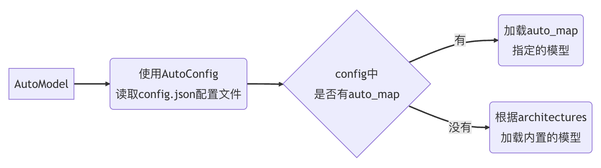

# PhyAssist source code
## Structure
1. **adapter_mentalLLama_DR**:  ``
    Fine-tuning Adapter on the mentalLLama dataset DR
2. **adapter_mentalLLama_dreaddit**:  
 Fine-tuning Adapter on the mentalLLama dataset dreaddit.
3. **adapter_mentalLLama_Final**:  
 Adapter for on mentalLLama dataset Irf, MultiWD,
SAD
4. **adapter_mentalLLama_nbertagnolli**:  
 Fine-tuning Adapter on the mentalLLama dataset nbertagnolli
5. **MentalLLaMA_dataset**:  
 The testbench for the mentalLLama dataset.
6. **nbertagnolli_dataset**:  
 The nbertagnolli dataset for training.
7. demo.ipynb:   
The web demo launching our model.
8. **gen_csv.py**:  
 clean the training data and make the data matching the format of the base model.
9. **Mistral_Fine_Tune.ipynb**:  
 The fine-tuning code for the base model.
10. **Mistralai_Test.ipynb**:  
 The testing code for the base model.

### 1. Dataset and Testbench
You may need download the IMHI dataset 
```
git clone https://github.com/SteveKGYang/MentalLLaMA.git
```
For the nbertagnolli dataset, you can download it using 
```
from datasets import load_dataset
load_dataset(data_path, split="train")
```
When you trying to use the testbenchs in the mentalLLama dataset, you need to follow the Readme.md in MentalLLaMA_dataset to download the classifier model to test the accuracy and download the Bart model to calculate the Bart score.

### 2. Data Preprocessing
The data preprocessing is in the gen_csv.py. You can use it to clean the data and make the data matching the format of the base model. The output is a csv file with a column named "text".

You can use it by
```
python gen_csv.py --origin_path <source_data_path> --new_path <output_path>
```
Before using, you need to change some code in the gen_csv.py to adapt to your data format. 
* The first place(line 22):
```python
data_content = "<s>[INST]"+ [The Question Columns] + " [/INST]  Anwser:" + [The Answer Columns] + "</s>"
```
* The second place(line 32-34):
```python
if(len(content) != [Your Data Columns Number]):
    continue
dirty_data = Columns[0] + ... + Columns[-1]
```

### 3. Data Fine-tuning
The fine-tuning code is in the **Mistral_Fine_Tune.ipynb**. You can use it to fine-tune the base model. The output is a adapter checkpoint. You can change the output path in the code.

### 4. Data Testing
The testing code is in the **mistralai_test.ipynb**. You can use it to test the accuracy of the base model. You can change the output path in the code.

In the testing code, there is some command to use the testbench in the mentalLLama dataset. 
If the command is facing some error, you can change the command according to the Readme.md in the **MentalLLaMA_dataset**.

### 5. The structure of the MentalLLaMA_dataset
1. model_output:
The output of our fine-tuning model on the test_data.
2. test_data:
the test data of the mentalLLama dataset. The model output is generated by our model using the data in **test_complete**.
3. src: 
/data/IDE-project/adapter_mentalLLama_FinalThe source code of the testbench.
* **IMHI.py** using a model provided by the user to generate the output with the test data.
* **label_inference.py** using the model output to calculate the **accuracy** of model's prediction. When using it, this code will ask you to download the classifier model the mentalLLama group has trained for each dataset they provided. 
* **socre.py** Calculate score on some benchmarks of the test data, which is used to judge the **quality** of the model prediction. When using it, this code will ask you to download some models of these benchmarks.

### 6. demo.ipynb
The demo.ipynb is the web demo launching our model using gradio. You can use it to test our model. 

# 知识点梳理：如何使用 transformers 库完成大语言模型的微调
本文档用于记录PhyAssist项目中涉及到的微调以及使用大模型的知识点，以便于后续的复现和参考。  
项目地址：https://github.com/PhyAssist-project/PhyAssist_source 

本篇文档中的很多内容都基于huggingface的文档，这里记录一下huggingface的NLP入门教程，可以作为参考。  
入门教程：https://huggingface.co/learn/nlp-course/chapter3/3?fw=pt
## 1. 模型的选择与下载
本次试验的资源基本上都来自huggingface，如果无法翻墙，可以使用镜像网站 https://hf-mirror.com
使用如下命令可以将所有transformers库的下载地址设置为镜像网站。
```shell
HF_ENDPOINT=https://hf-mirror.com 
```
模型下载部分的代码
```python
base_model = 'mistralai/Mixtral-8x7B-Instruct-v0.1'

bnb_config = BitsAndBytesConfig(
    load_in_4bit= True,
    bnb_4bit_quant_type= "nf4",
    bnb_4bit_compute_dtype= torch.bfloat16,
    bnb_4bit_use_double_quant= False,
)
model = AutoModelForCausalLM.from_pretrained(
        base_model,
        quantization_config=bnb_config,
        device_map="auto",
        trust_remote_code=True,
)
```
### 1.1 项目基座模型：Mixtra-8x7B-Instruct-v0.1 简要介绍
Mixtral 8x7B 是 Mistral AI 在2023年12月份新推出的一个大型语言模型，模型的参数量为46.7B，模型结构是**稀疏的专家混合网络**，在控制参数量规模并且提升模型推理速度的同时，性能也在多个测试集上匹配或优于 Llama_270B 以及 GPT3.5。下图取自Mistral AI的论文，展示了Mixtral 8x7B在多个测试集上的表现。


鉴于Mixtral 8x7B的优异性能，以及相对于GPT3.5等模型明显更低的在部署、训练、推理方面的空间与时间成本，在综合考虑了硬件资源的限制之后，选择了Mixtral 8x7B作为项目的基座模型。

接下来简要介绍一下Mixtral 8x7B的模型结构特点:
如下图所示，Mixtral采用被称为**稀疏的专家混合网络**的结构，基于解码器结构，这个结构的特点是将transformers的前递层（FFN）分为若干个专家，每个专家是一个小型的MLP，对于每个输入的token来说，只使用其中的两个专家对token进行计算，然后将计算结果进行加权求和，得到最终的输出。  
有一个路由层（Gating/Router）负责预测给定token具体由哪两个专家进行计算，它本质上也是一个可供训练的线性层。

打印出来的关键Decoder结构如下图：


这个结构的好处是在保证模型在前递全连接层的参数量不变（即网络的表达能力不变）的情况下，每次计算只使用其中的一部分参数，从而大大减少了在前递过程中的计算量，提升了模型的推理速度。Mixtra-8x7B的推理速度和成本与 12.9B 的模型大致相同。

与 Mixtral 8x7B 一起发布还有 Mixtral 8x7B Instruct，其在Mixtral 8x7B的基础上通过监督微调和直接偏好优化(DPO)进行优化，以让之严格的遵循指令，相对于 Mixtral 8x7B，Mixtral 8x7B Instruct 在多个测试集上的表现有所提升。因此在本次实验中，选择了 Mixtral 8x7B Instruct 作为基座模型。  
*注：DPO(Direct Preference Optimization)是一种让模型的输出更偏向于人类喜好的微调方法，与RLHF(Reward Learning from Human Feedback)相比，理解难度、实现难度和资源占用都更加友好。*

Mixtral 8x7B 论文地址：
https://arxiv.org/pdf/2401.04088.pdf  
DPO 项目地址：
https://github.com/eric-mitchell/direct-preference-optimization


### 1.2 AutoModel 自动加载模型
```python
from transformers import AutoModel
model = AutoModel.from_pretrained(model_name_or_path)
```
AutoModel 是 huggingface 提供的一个类帮助我们快速加载一个预训练模型。提供的方法用于自动完成模型类别推理、模型文件列表映射、模型文件下载及缓存、类对象构建等一系列操作。  
其中常用的有两个方法：
* from_config(config): 给定一个配置文件加载模型，这个方法只会加载模型的框架，不会加载模型的权重。config文件可以通过```AutoConfig.from_pretrained(model_name_or_path)```来获取。
* from_pretrained(model_name_or_path, **kwargs): 从预训练模型的名称或者路径加载模型，这个方法会将预训练模型的权重加载到模型中。如果预训练模型没有下载到本地，那么会自动从 huggingface 的模型仓库中下载。模型的保存地址默认为：*~/.cache/huggingface/transformers*.

**AutoModel 的实现原理简要介绍：**  
对于多数模型，都有内置的Model类用于模型的加载，比如BertModel、GPT2-Model等，这些常用的模型的加载类都被集成到了transformers库中，但对于那些没有内置类的模型（如ChatGLM）或者新模型，transformers 库又该怎么加载他们？为了解决这个问题，就给出了AutoModel这么一个通用的模型加载方法。  

AutoModel 的大致逻辑如下图：

AutoModel 会根据给定的模型名称或者路径，在huggingface的模型仓库中查找对应的模型配置文件config.json。
```json
"auto_map": {
    "AutoConfig": "configuration_chatglm.ChatGLMConfig",
    "AutoModel": "modeling_chatglm.ChatGLMForConditionalGeneration",
    "AutoModelForSeq2SeqLM": "modeling_chatglm.ChatGLMForConditionalGeneration"
}
```
如果config文件中有auto_map字段，那么AutoModel会根据auto_map字段中的映射关系，找到对应的模型类进行模型创建，并将模型参数加载到模型中。  
如果没有auto_map字段，那么AutoModel会对模型的结构进行推测，如果模型的结构符合transformers库中的内置模型，那么会使用内置模型类进行模型创建，并将模型参数加载到模型中。  
如果既没auto_map，也不在内置模型中，就会报错。


### 1.3 AutoModelForCausalLM
在本次实验中，我们使用的是AutoModelForCausalLM类进行模型加载。  
```python
from transformers import AutoModelForCausalLM
model = AutoModelForCausalLM.from_pretrained(model_name_or_path,trust_remote_code=True)
```
AutoModelFor...是 AutoModel 的子类，用于指定模型的任务类型。例如将BERT用到文本分类任务，可以使用 **AutoModelForSequenceClassification**。这个任务类型必须是模型可以做的，否则会报错，比如不能使用Bert做图片分类任务。  

对于指定的的任务类型，transformers库会对模型进行一些改造，比如在BERT的基础上添加一个分类层。添加上的分类层是随机初始化的，需要我们自己进行训练。

**AutoModelForCausalLM**是专门用于加载因果语言模型的类，也就是只有Decoder的Transformer模型，GPT就是这一类，本次实验使用的 **Mixtral-8x7B-Instruct-v0.1** 也是这一类，因此在实验中使用这个方法进行基座模型的加载。

对于本次试验采用的 **Mixtral-8x7B-Instruct-v0.1** 模型，transformer中已经提供了模型的实现方法：**MistralForCausalLM**，因此在加载模型时，AutoModelForCausalLM会直接调用这个方法进行模型的加载。查看源代码得知，此函数在 MistralModel 的基础上添加了一个线性层，用于将模型的输出映射到词表上。
```python
self.lm_head = nn.Linear(config.hidden_size, config.vocab_size, bias=False)
```


### 1.4 模型的量化
在本实验中，由于使用的模型**Mixtral-8x7B-Instruct-v0.1**所占内存过大，需要使用模型量化的方法进行压缩。采用的量化方法被称为Qlora，即4-bit Quantized Model 和 Low-Rank Adapters的结合。

此处简要介绍一下模型量化的原理，以最常见的 **最大绝对值量化** 为例，量化与反量化的过程如下图所示，表示了如何将一个32位的浮点数量化为8位的浮点数，然后再反量化回32位浮点数。

整个过程其实就相当于将原数据中的最大值映射到127，其余数据保持彼此比例关系映射到-127~127之间。其中$c^{FP32}=\frac{127}{absmax(X^{FP32})}$称为量化常数，保存下来用于反量化。round是四舍五入函数，正是四舍五入的操作导致了量化的精度损失。

为了尽量减少量化过程中模型性能的损失，量化时要尽力保证模型参数的整体分布大致不变。

Qlora采用的是4-bit量化，使用了数据结构4bit-NormFloat，给出了如下的量化步骤  
1. 分位量化：为了避免输入中出现一个很大的值导致其余值均被量化为0，导致模型性能的损失，Qlora采用了分位量化的方法，将输入数据分为若干个区间，每个区间内的数据量化为一个值。
2. 分块量化：将一个张量分为若干个块，每个块内的数据单独生成一个量化常数进行量化。这个方法可以将张量中值相差很大的数据分开量化，由于4-bit数据只有16个值，因此将太多的数据一起量化不可避免地导致过多的不同数据被量化为同一个值，导致模型性能的损失，分块量化可以有效避免这个问题。
3. 双重量化：分块量化中由于每个块都会带来一个量化常数，因此会引起额外开销，因此将32位量化常数也进行量化到8位。
4. 分页优化器：在GPU显存不足的时候可以把optimizer转移到内存中，在需要更新optimizer状态时再加载回来，以此来减少GPU显存的峰值占用。

关于量化后的模型性能损失的评估，在Qlora的原始论文证明了通过Qlora进行微调后的模型在多个测试集上的表现与 **16-bit全参数微调** 以及 **16-bit lora微调** 相当，这说明了使用Qlora并不会带来模型明显的性能下降。


在使用Qlora进行量化后，本实验成功将有46.7B参数量的模型压缩至27.6GB显存存储，原预训练模型参数文件的大小为96.8GB，压缩后模型大小约为原模型的28%。

Qlora的具体介绍可以参考这篇博文：  
https://zhuanlan.zhihu.com/p/666234324   
Qlora原始论文：  
https://arxiv.org/abs/2305.14314


```python
from transformers import BitsAndBytesConfig
bnb_config = BitsAndBytesConfig(
    load_in_4bit= True, 
    bnb_4bit_quant_type= "nf4",
    bnb_4bit_compute_dtype= torch.bfloat16,
    bnb_4bit_use_double_quant= True,
)
model = AutoModelForCausalLM.from_pretrained(
        ...
        quantization_config=bnb_config,
)
```
参数说明：
1. BitsAndBytesConfig：
* load_in_4bit：设置为True时，将模型的线性层用 FP4 或 NF4 量化。
* bnb_4bit_quant_type：指定具体的量化方法，可以是FP4或NF4。FP4指的是IEEE754标准中的4-bit浮点数，NF4指的是Qlora中的4-bit量化方法。
* bnb_4bit_compute_dtype：指定进行计算时的数据类型，此处设置为16位浮点数。4-bit浮点数一般只用于压缩存储，进行正向传播和反向传播时精度太低，因此需要在使用时反量化为更多位的浮点数进行计算。
* bnb_4bit_use_double_quant：使用双重量化。


### 1.5 将模型加载到多个GPU上
由于模型过大，即使进行量化之后，单个GPU无法存储整个模型，因此需要将模型加载到多个GPU上。  
```python
model = AutoModelForCausalLM.from_pretrained(
        ...
        device_map="auto",
)
```
在from_pretrained函数中，一个重要参数device_map，可以很方便地控制模型在硬件上的部署方式。   

device_map的实现靠的是accelerate库的支持，acclerate库的简单介绍可以参考huggingface的文档 https://huggingface.co/docs/accelerate/index  

在设置device_map参数后，accelerate库会按照如下规则进行模型部署：
* 首先充分利用GPU上的显存资源
* 如果GPU上资源不够，那么就将权重存储到内存
* 如果内存还不够用了，将会使用内存映射的技术，将剩余的参数存储到硬盘上

device_map的具体值的不同选项对应不同的GPU部署策略，常用的有：
* "auto"：将会在所有的GPU上平衡切分模型。
* "balanced_low_0" 会在除了第一个GPU上的其它GPU上平衡划分模型，并且在第一个 GPU 上占据较少资源。这个选项符合需要在第一个 GPU 上进行额外操作的需求。
* "sequential" 按照GPU的顺序分配模型分片，从 GPU 0 开始，直到最后的 GPU。

一般来说，使用"auto"就可以满足大部分需求了，本次实验也是使用的这个选项，使用后，模型在两个GPU上的分布如图所示：


## 2. 模型的微调
关于模型的微调，关键的问题还是如何控制模型的显存占用和训练速度，由于在实验中装载模型就已经占据了大半的显存容量，前向传播和反向传播产生的中间结果会很快耗尽显存容量。此时就需要使用一些技巧来进行模型的微调。
### 2.1 Lora (Low-Rank Adapters)
前面介绍了Q-lora技术中的量化手段，Q-lora本身就是在Lora的基础上对基座模型进行量化。Lora的基本思想就是在预训练模型进行微调以适应下游任务时，将模型本身的参数进行冻结，转而训练一个低秩矩阵。

具体来说，也就是对于任何一个参数矩阵 $C_{m\times n}$ 来说，初始化两个低秩矩阵 $A_{m\times r}$ 和 $B_{r\times n}$ ，在进行前向传播时，使用 $C+sAB$ 来进行计算（其中s是一个缩放标量），进行反向传播时，使用上层传来的梯度更新 $A$ 和 $B$ ，而不更新 $C$ ，具体结构如下图所示。这样就将训练的目标由原来的一个参数矩阵转变为了两个低秩矩阵，大大减少了参数量（从 $mn$ 减少至 $r(m+n)$，其中r一般是一个很小的常数，16或32）。


对于模型的任何一个参数矩阵都可以这样进行低秩分解，而分解出来的矩阵A和B的集合就被称为 **Adapter**。

值得注意的是，在训练时 C、A、B 三个矩阵是彼此独立的，因此可以随时将Adapter添加到模型中（C+AB），也可以随时将Adapter从模型中移除。这赋予了Adapter很强的灵活性，可以根据需要随时添加或移除Adapter，也可以在同一基座模型上安装不同的Adapter，让它能够适应不同的下游任务。

可以使用peft库（Parameter-Efficient Fine-Tuning）来实现Lora。  
peft的项目地址：https://github.com/huggingface/peft  
```python
from peft import LoraConfig, prepare_model_for_kbit_training, get_peft_model
model = prepare_model_for_kbit_training(model)
lora_alpha = 32 # scaling factor for the weight matrices
lora_dropout = 0.05 # dropout probability of the LoRA layers
lora_rank = 32 # dimension of the low-rank matrices

peft_config = LoraConfig(
    lora_alpha=lora_alpha,
    lora_dropout=lora_dropout,
    r=lora_rank,
    bias="none",
    task_type="CAUSAL_LM",
    target_modules=["q_proj", "k_proj", "v_proj", "o_proj", "gate"]
)
# get_peft_model returns a Peft model object from a model and a config.
model = get_peft_model(model, peft_config)
```
对上述代码做出一些解释：
* prepare_model_for_kbit_training(model)：做一些准备工作，将量化模型转换为适合进行Lora微调的模式。这里贴上源代码中的注释，**具体为何要做这些工作还需要进一步研究**。  
    1- Cast the layernorm in fp32   
    2- making output embedding layer require grads   
    3- Add the upcasting of the lm-head to fp32 
* lora_alpha：缩放因子，也就是上述介绍中的s。
* lora_dropout：Lora层的dropout概率，对于AB两个参数矩阵也要进行dropout用于正则化。
* r：低秩矩阵的秩。
* bias：Lora层的偏置类型，可以是none、full或者half，一般设置为none，因为设置的偏置会直接叠加到原模型的偏置中，在训练中进行更新，因此即使去掉Adapter后，原模型的效果仍然会发生改变。
* task_type：任务类型，因为本次实验是因果语言模型，因此设置为CAUSAL_LM。
* target_modules：需要进行低秩分解的模型参数矩阵，应该设置为原模型中的一些关键层，这些层的名字可以通过 ```model.named_parameters``` 来获取。如下图，可以进行低秩分解的参数矩阵有 **q_proj、k_proj、v_proj、o_proj、gate** 等，expert层应该也可以进行分解，但在本次试验中并未进行尝试。
* get_peft_model：用于创建一个 PeftModel 类型的模型。

经过上述改造后得到的Peft模型结构如下，以q_proj为例可以看到，原模型中的q_proj层被替换为了一个Lora层，其中包含了两个低秩矩阵A和B，以及一个dropout层。


打印出来模型的可训练参数可以看到，模型训练的参数量得到了大幅度的减少。
```python
print_trainable_parameters(model)
# trainable params: 31465472 || all params: 23514066944 || trainable%: 0.13381552444728806
```

与量化的问题一样，在微调的时候仅微调一部分参数，是否会导致模型微调的效果下降？也就是不能很好地适应下游任务？在lora论文中，通过大量的对比实验，作者证明了Lora的有效性，具体实验数据可以参考Lora论文。作者同时通过如下三个问题对Lora的有效性进行了解释。我们可以从中得到一些使用Lora的经验。
1. LORA应该作用于Transformer的哪个参数矩阵？  
在实际操作中，应当将可微调参数分配到多种类型权重矩阵中，而不应该用更大的秩单独微调某种类型的权重矩阵。
2. LORA最优的秩r是多少？
在r小到1或者2的时候，LORA的仍有不错的效果，作者通过实验证明了更新参数矩阵 $\Delta W$ 存在极小的‘内在秩’。
3. 参数增量 $\Delta W$ 和 $W$ 的关系？
相比于随机矩阵，$\Delta W$ 和 $W$ 有很强的关联性。$\Delta W$ 仅放大了 $W$ 中任务相关的特征。且在r很小的情况下就能达到很大的放大效果。

由此可见，Lora的更新矩阵$\Delta W$虽然秩很小，但是由于它能够相对精确的去放大原模型的参数矩阵$W$中与下游任务相关的特征，而不是兼顾所有的特征，因此它的效果还是非常好的。

Lora的原论文：https://arxiv.org/pdf/2106.09685.pdf

### 2.2 梯度检查点 Gradient Checkpointing
梯度检查点也是在训练中节省内存的一个小技巧，因此在这里记录一下。  

在普通的训练过程中，需要将正向传播中所有的中间结果都保存下来，以便于反向传播时使用，这是训练时会占用远大于模型本身的内存的主要原因。Gradient Checkpointing在2016年的 [Training Deep Nets With Sublinear Memory Cost](https://arxiv.org/abs/1604.06174) 论文中引入。

它的基本思想是以时间换空间，在正向传播的过程中设置检查点，只保存检查点处的中间结果，其余中间结果在反向传播时从最近的检查点开始重新计算。这样可以大大减少内存的占用，但是会增加计算量，因为需要重新计算一部分中间结果。作者证明了梯度检查点可以显著降低内存利用率，从 O(n) 到 O(sqrt{n})，其中 n 是模型中的层数。

在transformers库中，可以非常方便地开启梯度检查点，只需要在模型初始化时加入如下代码即可。注意一定要在开启梯度检查点之前将model的config.use_cache设置为False，因为use_cache属性与梯度检查点不兼容。


### 2.3 Trainer 函数与它的参数
Transformers中为我们封装好了一个很完善Trainer类，可以帮助我们快速进行模型的训练，只需要配置一些参数。由于大模型的训练需要很多的优化手段，因此手写训练代码会比较复杂，使用Trainer可以大大简化训练代码的编写。

这里分享一下transformers文档中给出的 [问答模型训练实例](https://github.com/huggingface/transformers/blob/1c06240e1b3477728129bb58e7b6c7734bb5074e/examples/legacy/question-answering/run_squad.py)，其中涉及到了Trainer中的部分代码，可以学习一下。  

Trainer中的参数非常多，接下来只介绍一部分在训练过程中遇到的重要参数，更详细的内容可以查看官方文档：  
https://huggingface.co/docs/transformers/main_classes/trainer

```python
from trl import SFTTrainer
from transformers import TrainingArguments
training_arguments = TrainingArguments(···)
trainer = SFTTrainer(
    model=model,
    train_dataset=dataset,
    peft_config=peft_config,
    dataset_text_field="text",
    tokenizer=tokenizer,
    args=training_arguments,
    packing= False,
)
```

1. TrainingArguments 用于配置训练参数，其中配置的主要是训练策略。
* **gradient_accumulation_steps**：梯度累积的步数，同样是用于减少显存占用，多次正向传播将梯度累积到一定的步数后再进行一次反向传播，相当于增大了batch_size，但是不会增大显存占用。
* **optim="paged_adamw_32bit"**：使用adamw，paged说明采用paged-memory优化内存使用，防止内存峰值打断训练。  
    目前还有一个问题，**为何可以使用32bit，而不会导致与前面的量化模型不配套？**
* **fp16**：训练时使用16bit精度进行计算，这与前面的量化策略配套。
* **warmup_ratio**：预热的步数。  
    注：由于刚开始训练时,模型的权重(weights)是随机初始化的，此时若选择一个较大的学习率,可能带来模型的不稳定(振荡)，选择Warmup预热学习率的方式，可以使得开始训练的几个epoches或者一些steps内学习率较小,在预热的小学习率下，模型可以慢慢趋于稳定,等模型相对稳定后再选择预先设置的学习率进行训练,使得模型收敛速度变得更快，模型效果更佳。
* **lr_scheduler_type**：学习率的调整策略，constant表示不单独调整学习率，只依靠warmup和adamw进行调整。
* **logging_steps**：打印loss等信息的步数
* **save_steps**：保存模型的步数，默认每多少步保存一个checkpoint。

2. SFTTrainer
SFTTrainer是Trainer的子类，增加了处理PeftConfig的逻辑，专门用于实现Lora的微调。具体的使用方法可以参考官方文档：https://huggingface.co/docs/trl/main/en/sft_trainer。  
我并未对SFTTrainer进行过多的研究，但根据hugging face中的文档中的说明，它相对于普通的trainer函数额外提供了一些数据处理相关的功能，这一点在数据处理部分会详细介绍。  
在调用trl库时，可能会出现版本错误，需要将 typing_extensions 更改为 4.5.0版本。
```shell
pip install typing_extensions==4.5.0
```

在得到了trainer函数之后，就可以使用trainer.train()函数进行模型的训练了。值得注意的是，SFTTrainer在训练PeftModel时会将训练结果保存为一个checkpoint，里面重点是一个 "adapter_model.safetensors"文件，这个文件中保存了Adapter的参数，在使用模型时需要将这个文件加载进来。

如果训练意外中断，可以使用如下代码让模型从最近checkpoint开始继续训练。
```python
trainer.train(resume_from_checkpoint=True)
```

### 2.4 训练信息的保存 wandb
训练的结果会被保存在TrainingArguments中指定的文件夹里，模型的loss和测试精度（如果提供了测试集的话）会打印在终端，但我们往往需要其他更多的训练中的信息，比如训练时间、GPU内存占用、GPU功耗等其他信息，此时可以通过wandb来记录实验数据。

wandb是一个免费的，用于记录实验数据的工具。wandb相比于tensorboard之类的工具，有更加丰富的用户管理，团队管理功能，更加方便团队协作。

wandb的简介以及如何使用参考官网：https://docs.wandb.ai/tutorials/huggingface

### 2.5 一点大模型微调的经验
对于大模型的微调来说，在时间有限的情况下，往往需要在训练数据集的规模和训练轮数之间做出取舍。我第一开始使用了包含很多数据的数据集进行训练，但很长时间才能训练完一轮，在epoch轮数较少的情况下，模型对下游任务的适应能力并没有显著提升，损失也一直维持在1.5左右波动，因此我将数据集的规模进行缩小，转而训练更多的epoch，观察到模型的损失得到了显著的下降。

因此我认为可以让模型多训练几轮，而不是一味地增加数据集的规模，对于模型适应下游任务的能力更有帮助，可能是因为微调的目的是让模型学会下游任务的回答范式，对典型的几个回答范式进行多次训练，比对大量的回答范式进行少次训练更有帮助，且由于大模型本身已经进行了大量的预训练，因此不用太过担心大模型会出现太明显的过拟合的情况。

上述还只是一些经验之谈，没有什么理论依据，要搞清楚的话后续还需要进一步研究。对于本实验来说，无疑需要更多的训练数据来进一步提升模型的效果，这也是后面需要完善的地方。


## 3. 数据处理
### 3.1 数据集的加载
数据集的加载使用了datasets库，datasets库是huggingface提供的一个用于加载数据集的库，可以方便地加载常用的数据集或者进行数据处理，也可以加载自定义的数据集。  
huggingface文档如下：https://huggingface.co/docs/datasets/loading

如果要加载 huggingface 中的数据集，那么简单的使用方法如下：
```python
from datasets import load_dataset
train_dataset = load_dataset(dataset_name, split="train[:90%]")
test_dataset = load_dataset(dataset_name, split="train[90%:]")
```
load_dataset会返回一个Dataset类型，这个类型可以直接传入trainer函数中进行训练。split_name的格式是"train[a:b]"，里面是一个切片，表示从第a个样本到第b个样本，这样可以方便地使用数据集中的指定部分创建训练集、验证集和测试集，上述代码就实现了将数据集切分为90%的训练集和10%的测试集。

对于本地的数据集，需要指定数据集的路径以及数据集文件的类型，如下代码从两个"json"类型文件中创建了train、test数据集：
```python
dataset = load_dataset(
    "json",
    data_files={
        "train": "data/train.json",
        "test": "data/test.json",
    },
)
```

### 3.2 数据集的处理
数据的处理是模型训练中非常重要的一部分，语言模型对于输入的要求是相对严格的，特别是对于预训练模型，输入的格式保持预训练时的格式一致能够最大程度发挥出模型的效果。这里记录几种在实验中遇到的关于数据处理的知识点。  

数据集的处理一般与tokenizer密切相关，关于Tokenizer，或者说对于语言模型的数据处理部分我的理解不是很深刻，这里介绍一个框架和最基本的使用方法，其他的细节还需要进一步研究。

Tokenizer在huggingface中的文档：https://huggingface.co/docs/transformers/main/en/main_classes/tokenizer

**3.2.1 Tokenizer**  
Tokenizer分词算法是NLP大模型最基础的组件，基于Tokenizer可以将文本转换成独立的token列表，进而转换成输入的向量成为计算机可以理解的输入形式。

首先简要介绍一下Tokenizer的工作原理，Tokenizer包括训练和推理两个环节。训练阶段指得是从语料中获取一个分词器模型。推理阶段指的是给定一个句子，基于分词模型切分成一连串的token。基本的流程如图所示，包括归一化，预分词，基于分词模型的切分，后处理4个步骤。

* 归一化：最基础的文本清洗，包括删除多余的换行和空格，转小写，移除音调等。
* 预分词：把句子切分成更小的“词”单元。可以基于空格或者标点进行切分。 不同的tokenizer的实现细节不一样。
* 模型分词：基于分词模型（如BPE）进行进一步的切分，比如会将“don't”切分为“do”和“n’t”。
* 后处理：会包括一些特殊的分词逻辑，例如添加special token：[CLS],[SEP]等。

上述过程中提到了分词模型，分词模型是Tokenizer的核心，这个模型也需要进行训练，输入是给定语料，通过训练算法，生成合并规则和词表。为什么不直接通过空格来分词，还要用一个模型？这是因为一些词比如“speaker”明显是 speak 和 er 的组合，很明显这时就需要将speaker划分成两个token，这样可以有效减少词汇表的大小。

对于后处理中的special token，这些token是语言模型输入格式中很重要的一部分，模型通过它们获得重要的信息，比如输入的句子的开始和结束（比如在Mixtral模型中的开始字符<SOS>，结束字符<EOS>，无效字符<UNK>）、输入部分的特征（比如在Mixtral模型中使用[INST][/INST]来标记中间的内容为instruction，是用户提供给模型的信息，在计算损失的时候不需要计算这部分）。因此在使用Tokenizer时，需要特别关注一下这些特殊token的使用方法。

**3.2.2 Tokenizer 的使用方法**
huggingface中的模型项目中都会提供一个 tokenizer.config 文件，Transformers库中AutoTokenizer类会根据这个文件中的配置来构建出对应的分词器，其实如果将分词器看作一个特殊的模型的话，加载分词器的过程就和加载模型的过程一样了。  
```python
from transformers import AutoTokenizer
tokenizer = AutoTokenizer.from_pretrained(base_model, trust_remote_code=True)
```
Mistral模型在huggingface的仓库中，我们可以发现如下三个关于加载tokenizer的文件，from_pretrained函数会根据这三个文件构建tokenizer：
* tokenizer_config.json：分词器的配置文件，用于构建分词器的基本结构。
* tokenizer.json：分词器的词表文件，格式大致是```{id:1, special_token:T/F, content:hello}```，被分词器用来将分好的词转换为向量，即id。
* tokenizer.model：分词器模型组件，比如BPE模型等。

Tokenizer一般不需要什么手动的特殊配置，模型的作者会提供一个默认的分词器，这个分词器在大部分情况下都能满足需求。将初始化得到的tokenizer传递到SFTTrainer中，SFTTrainer就会自动使用它来处理输入的数据，使用十分方便。

接下来给出一个tokenizer的使用示例
```python
from transformers import AutoTokenizer
tokenizer = AutoTokenizer.from_pretrained("mistralai/Mixtral-8x7B-Instruct-v0.1")
output = tokenizer.encode("你好呀")
print(output)
print(tokenizer.decode(output))
# [1, 28705, 29383, 29530, 232, 148, 131]
# <s> 你好呀 </s>
```

**3.2.3 简单的数据处理工具**
在dataset中，提供了一种非常方便的操作Dataset类型数据的方法，就是使用map函数，map函数可以对Dataset中的每一个样本进行指定规则变换操作，能够完成一些最基本的数据处理操作，并且实测处理速度很快。下面的代码实现了对数据集中每一个样本的分词操作。
```python
def preprocess_function(examples):
    return tokenizer(examples["text"], truncation=True, padding="max_length")
dataset.map(preprocess_function, batched=True)
```
可见基本的逻辑很简单，就是设计一个处理函数，将处理函数传递给map函数，map函数会对数据集中的每一个样本都调用一次处理函数，将处理函数的返回值作为新的样本。

除了Map之外，Dataset还提供了很多其他包装好的操作，具体可以参考官方文档：https://huggingface.co/docs/datasets/process

### 3.3 保证数据集的格式
在使用Tokenizer对数据集进行处理时，需要保证数据集的格式与预训练时的格式一致，否则会导致模型无法正常训练或者效果的显著降低。

关于数据集的格式，在huggingface的对应模型项目中一般会给出示例，可以用作参考，比如Mistral_instruct 模型的文档中就给出了如下示例：
```
<s> [INST] Instruction [/INST] Model answer</s> [INST] Follow-up instruction [/INST]
```

还可以到 tokenizer_config.json 文件中查看tokenizer的配置，其中的 **chat_template** 字段给出了tokenizer的输入格式。
```json
"chat_template": "{{ bos_token }}{% if (message['role'] == 'user') != (loop.index0 % 2 == 0) %}{{ raise_exception('Conversation roles must alternate user/assistant/user/assistant/...') }}{{ '[INST] ' + message['content'] + ' [/INST]' }}{{ message['content'] + eos_token}}{{ raise_exception('Only user and assistant roles are supported!') }}"
```

这里给出一种使用SFTTrainer功能来保证输入格式与要求格式一致的方法，这种方法的好处是十分方便，不用特别关注实际的输入格式。
SFTTraienr支持一些固定的特殊输入格式，如下面所示，只需要将数据集构造成这种形式，SFTTrainer会自动调用 apply_chat_template 方法，将数据集转换为 **chat_template** 字段中指定的格式。
* conversational format
```json
{"messages": [{"role": "system", "content": "You are helpful"}, {"role": "user", "content": "What's the capital of France?"}, {"role": "assistant", "content": "..."}]}
{"messages": [{"role": "system", "content": "You are helpful"}, {"role": "user", "content": "Who wrote 'Romeo and Juliet'?"}, {"role": "assistant", "content": "..."}]}
{"messages": [{"role": "system", "content": "You are helpful"}, {"role": "user", "content": "How far is the Moon from Earth?"}, {"role": "assistant", "content": "..."}]}
```

* instruction format
```json
{"prompt": "<prompt text>", "completion": "<ideal generated text>"}
{"prompt": "<prompt text>", "completion": "<ideal generated text>"}
{"prompt": "<prompt text>", "completion": "<ideal generated text>"}
```

## 4. 模型的测试和部署
在完成了模型的训练之后，接下来的工作就是对模型的表现进行测试，构建一个demo，将模型发布出去等工作，这里记录一下完成这些工作需要涉及到的知识。
### 4.1 如何使用训练好的模型进行测试
我们训练好的adapter被存储于指定的路径中名字为checkpoint-xxx的文件中，这个文件中包含了adapter的参数，因此在使用我们自己微调完成的模型时，需要分为两步：加载基座模型和将adapter加载到基座模型中。
```python
from transformers import AutoModelForCausalLM, BitsAndBytesConfig
from peft import PeftModel, PeftConfig
# 加载基座模型，基座模型的配置需要和微调时的配置一致
bnb_config = BitsAndBytesConfig(
    load_in_4bit= True,
    bnb_4bit_quant_type= "nf4",
    bnb_4bit_compute_dtype= torch.bfloat16,
    bnb_4bit_use_double_quant= False,
)

peft_base_model = AutoModelForCausalLM.from_pretrained(
    config.base_model_name_or_path,
    return_dict=True,
    quantization_config=bnb_config,
    device_map="auto",
    trust_remote_code=True,
)

# 将目标adapter加载到基座模型中
PEFT_MODEL = "your_adapter_path"
model = PeftModel.from_pretrained(peft_base_model, PEFT_MODEL)
```
值得注意的是，如果训练了多个adapter，还可以通过如下代码将多个adapter同时加载到模型中，这样就可以在同一个基座模型上加载多个adapter，适应多个下游任务。
```python
# 获取adapter的配置
config = PeftConfig.from_pretrained(PEFT_MODEL)
# 第一个adapter通过from_pretrained加载
model = PeftModel.from_pretrained(peft_base_model, PEFT_MODEL)
# 后面的adapter通过add_adapter方法加载
model.add_adapter(PEFT_MODEL2, peft_config=config)
model.add_adapter(PEFT_MODEL3, peft_config=config)
    ···
# 要注意的是，使用add_adapter后新加入的adapter并不会立即生效，需要调用adapter_setup方法进行激活
# 虽然能够加载多个adapter，但是在使用时只能使用一个adapter，因此需要在使用前设置adapter
model.set_adapter(PEFT_MODEL2)
```

如果想要将多个adapter合并成一个adapter，可以使用merge_and_unload函数进行合并。
```python
    ckpt_list = ["checkpoint-1000", "checkpoint-2000", "checkpoint-3000"]
    for checkpoint in ckpt_list:
        print('Merge checkpoint: {}'.format(checkpoint))
        model = PeftModel.from_pretrained(model, os.path.join(lora_model, checkpoint))
```

### 4.2 模型的测试：测试集与测试指标
测试大模型的能力通常是使用一个测试集，测试集提供一个输入和一个金标准答案，将模型的生成文本与金标准答案进行比较，比较的方法根据使用的评测指标来决定。

在本次试验中，使用了MentalLLama中提供的测试平台进行测试，测试分为两部分：模型结果的精确度和质量，分别对应了两个指标：F1和BartScore。前者表示模型生成的文本与金标准答案的重合度，后者表示模型生成的文本的质量，即是否通顺、是否符合语法等。测试平台的使用方法详见 MentalLLama 项目的文档：https://github.com/SteveKGYang/MentalLLaMA.git

对于F1指标的计算，MentalLLama选择采用了chatgpt对问题的回答作为金标准答案，因此在测试时，需要将模型生成的文本与chatgpt的回答进行比较，计算F1值。这是一种低成本的测试方法，但是也有一定的局限性。可以进一步研究一下这种测试集构建方式。

MentalLLama的测试集构建方法可以扩展至其他领域的训练集、测试平台的构建，可以将其中可以复用的方法提炼出来，设计一套构建测试集和测试平台的通用方法。这是一个很有意义的工作，可以在后续的工作中进行尝试。

### 4.3 测试 demo 的构建
使用gradio库可以很方便地构建一个简单但功能完善的demo，来进行模型的测试和展示。
gradio的文档：https://www.gradio.app/docs/interface
demo的构建过程可以参考项目中的demo.py文件，这里不再赘述。

### 4.4 模型的发布
在完成了模型的测试之后，就可以将模型发布到 huggingface 中了，huggingface提供了一个模型发布的平台，可以将模型发布到平台上，方便其他人使用。

发布模型需要首先登陆 huggingface 的账号
```python
from huggingface_hub import notebook_login
notebook_login()
```
接下来将需要发布的模型按照4.1中的方法进行加载，加载完成后的模型直接使用push_to_hub函数即可发布到 huggingface 平台上，比如下面的代码就向huggingface中推送了idegroup/PhyAssist模型。
```python
# 第一个参数为模型名字，第二个参数为你所属的组名
model.push_to_hub("PhyAssist", organization="idegroup")
```
值得注意的是，由于我们训练出来的模型以adapter的形式存在，因此在发布模型时只需要将adapter的参数进行上传，而不需要上传基座模型的参数信息，只需要上传所使用的基座模型的配置信息即可，在使用我们的模型时，huggingface会根据配置信息自动下载基座模型，然后将adapter加载到基座模型中。这方便了我们进行模型的发布，也方便了其他人使用我们的模型，因为adapter相对于整个模型来说，体积很小，上传和下载的速度都很快。

在上传了模型之后，就可以在 huggingface 平台上使用我们的模型了，使用方法如下：
```python
from transformers import AutoModelForCausalLM
model = AutoModelForCausalLM.from_pretrained("idegroup/PhyAssist")
```


---------------------------
#### 以上就是在本次试验中学习到的一些知识点的简要整理，本实验可以用作一个简单的大模型训练的样例供读者学习，希望能够帮助读者更加快速地上手微调大模型。本文档的记录可能存在一些错误或者缺漏，如果本文档中与官方文档中的陈述有冲突，请以官方文档为准。如果读者发现了错误或者有更好的建议，欢迎提出issue或者直接联系我，谢谢！


测试模型性能的benchmark：  
我们使用了 **IMHI dataset** 作为测试模型性能的测试标准，这个数据集提供了面向心理咨询领域的测试标准，我们在此数据集上对模型进行了测试，你可以通过如下命令下载原数据集：
```bash
git clone https://github.com/SteveKGYang/MentalLLaMA.git
```
下载数据集后，按照其中Readme提供的指导即可开始测试。


